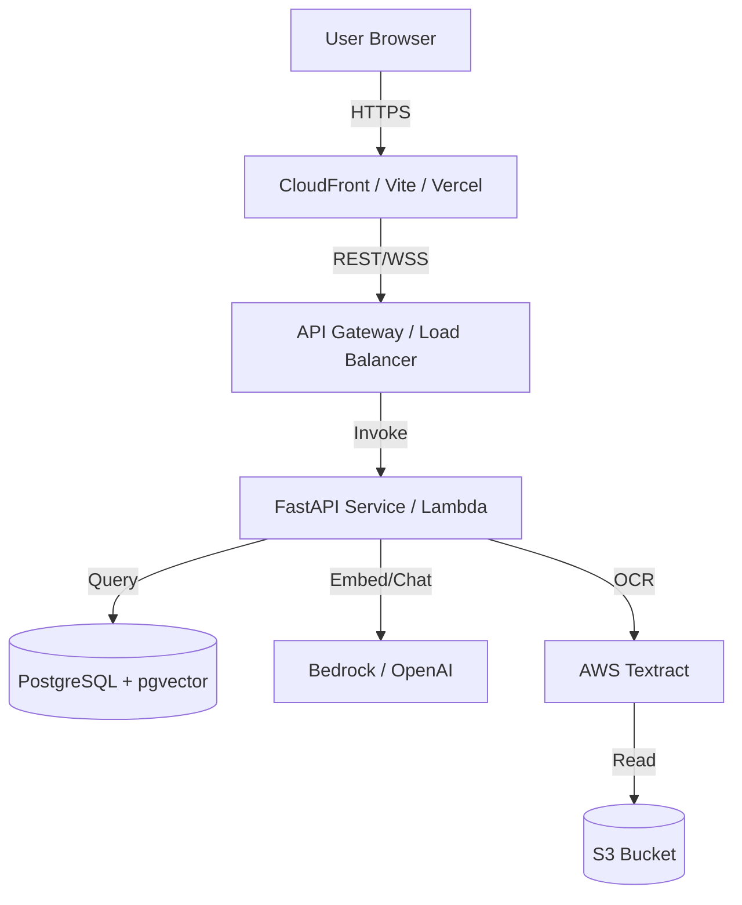
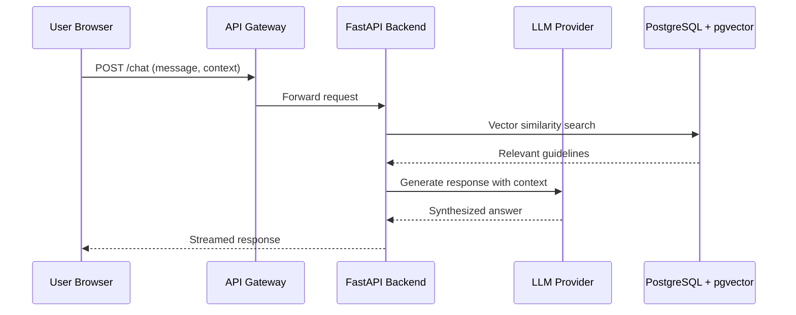
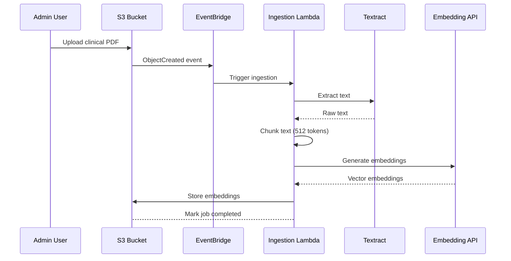

# IOPHA: System Architecture (High-Level Design)

## Table of Contents

| # | Section | Description |
|---|---------|-------------|
| 1 | [Executive Summary](#1-executive-summary) | System purpose and scope |
| 2 | [System Context](#2-system-context--scope) | Users, boundaries, in/out of scope |
| 3 | [High-Level Architecture](#3-high-level-architecture) | Diagram, trust boundaries, security zones |
| 4 | [Infrastructure](#4-infrastructure-topology-aws) | AWS service topology |
| 5 | [Data Flow](#5-data-flow-overview) | Chat flow and document ingestion sequences |
| 6 | [Compliance](#6-compliance--regulatory-posture) | HIPAA alignment and gap analysis |
| 7 | [Third-Party Integrations](#7-third-party-integrations) | pgvector, Textract, LLM provider |

## 1. Executive Summary

IOPHA (Interactive Obesity Prevention Health Assistant) is an AI-powered health assistant that delivers personalized, evidence-based obesity prevention guidance and routes high-risk users to in-network medical professionals immediately after risk detection. The assistant operates within hospital and healthcare organization ecosystems, delivering dual-pathway interventions: self-directed prevention tips and direct care scheduling.

## 2. System Context & Scope

### Users
- **At-risk adults**: Users identified by hospital risk models who need immediate, accessible guidance.
- **Medical administrators**: Stakeholders who need engagement analytics and conversion tracking.
- **In-network physicians**: Providers who receive pre-qualified patient referrals with risk context.

### System Boundaries
- **In Scope**: Chat interface, Risk Assessment integration, Clinical guideline ingestion, Physician directory lookup, Appointment scheduling, HIPAA-aligned data handling.
- **Out of Scope (Phase 2)**: EMR integration, Insurance verification, Telehealth sessions.

## 3. High-Level Architecture

### 3.1 Architecture Diagram

### 3.2 Trust Boundaries & Security Zones

| Zone | Components | PHI Exposure | Security Controls |
|------|------------|--------------|-----------------|
| Public Zone | CDN, Static Assets | None | HTTPS/TLS 1.3, WAF |
| Private Zone | API, Backend Services | Processed | JWT auth, rate limiting |
| HIPAA Boundary | Database, S3, LLM | At rest/in transit | AES-256 encryption, encrypted connections |

**PHI Entry Points**: User-submitted health data enters via authenticated API endpoints. All PHI is encrypted at rest (AES-256) and in transit (TLS 1.3).

## 4. Infrastructure Topology (AWS)

| Layer | Service | Decision Status | Notes |
|-------|---------|-----------------|-------|
| Compute | ECS Fargate or Lambda | Decision Pending | Criteria: Cold start tolerance, cost, scaling needs |
| Storage | S3 | Confirmed | For guideline document storage |
| Database | RDS PostgreSQL + pgvector | Decision Pending | Alternative: Neon, Supabase |
| AI/ML | Amazon Bedrock or OpenAI API | Decision Pending | Alternative: Azure OpenAI, self-hosted model |
| Orchestration | EventBridge → Lambda | Confirmed | For Textract processing triggers |

## 5. Data Flow Overview

### Chat Flow

### Document Ingestion Flow

## 6. Compliance & Regulatory Posture

### HIPAA Alignment

| Control Category | Implementation Status | Details |
|-----------------|---------------------|---------|
| Access Control (§164.308) | Implemented | Role-based auth (patient, admin), JWT with httpOnly cookies |
| Audit Logs | Partial | Ingestion job status logging; full audit trail needs enhancement |
| Integrity (§164.308) | Implemented | Input validation, data sanitization for Textract output |
| Transmission Security (§164.312) | Implemented | TLS 1.3 for all external connections |
| Encryption at Rest (§164.312) | Implemented | AES-256 for S3 and RDS |

### Gap Analysis

| Feature | Status | Notes |
|---------|--------|-------|
| BAA Signed with AWS | Required | Must be completed before production |
| Full Audit Trail | Pending | Internal logging needs enhancement for HIPAA audit requirements |
| Data Retention Policy | Pending | Define retention periods for PHI |

### References
- 45 CFR § 164.308 - Administrative Safeguards
- 45 CFR § 164.312 - Technical Safeguards

## 7. Third-Party Integrations

### PostgreSQL + pgvector
- **Why pgvector**: Enables semantic similarity search for clinical guidelines without separate vector database. Native PostgreSQL extension reduces operational complexity.

### AWS Textract
- **Why Textract**: Purpose-built OCR for healthcare documents with built-in PHI detection and redaction capabilities.

### LLM Provider
- **Why Bedrock/OpenAI**: Enterprise-grade compliance, HIPAA-eligible services, and mature embedding models. Selection depends on cost/scalability requirements.