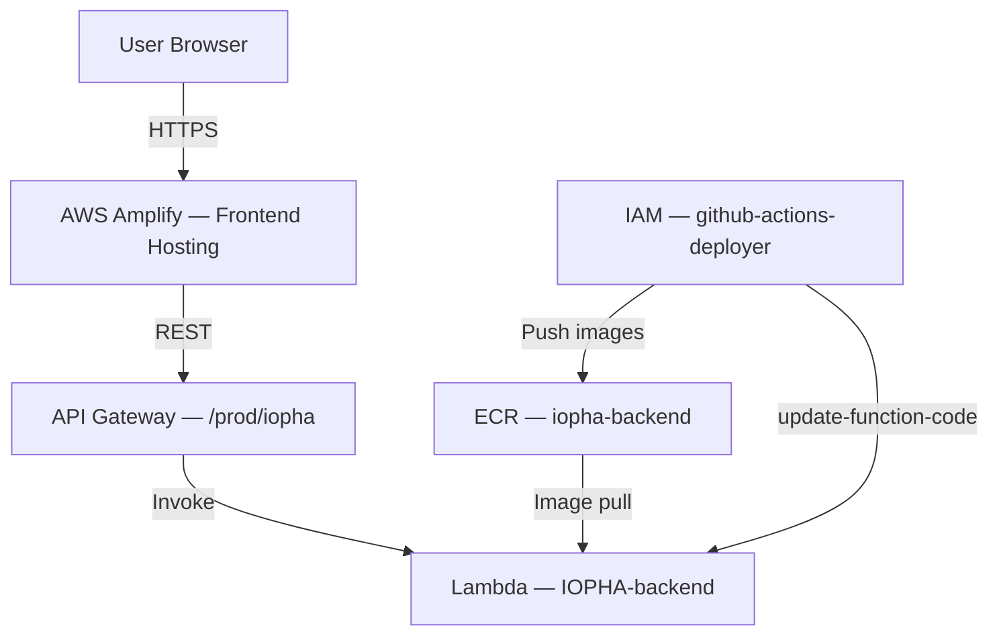

# IOPHA: AWS Technologies

This document inventories the AWS services currently in use by IOPHA, and how
each one is wired into the system. All resources live in region `us-east-2`.
The AWS account ID is intentionally withheld — this repository is public;
substitute your own account ID where `<aws-account-id>` appears.

## Table of Contents

| #   | Section                                            | Description                                              |
| --- | -------------------------------------------------- | -------------------------------------------------------- |
| 1   | [Overview](#1-overview)                           | Current AWS footprint                                    |
| 2   | [AWS Lambda](#2-aws-lambda)                       | Backend compute (container-image function)               |
| 3   | [Amazon ECR](#3-amazon-elastic-container-registry) | Container image registry                                 |
| 4   | [AWS IAM](#4-aws-identity-and-access-management)  | Deploy credentials and access control                    |
| 5   | [AWS Amplify](#5-aws-amplify)                     | Frontend hosting                                         |
| 6   | [Amazon API Gateway](#6-amazon-api-gateway)       | Public API entry point                                   |
| 7   | [Deployment Flows](#7-deployment-flows)           | Manual (`push-to-ecr.sh`) and CI (GitHub Actions)        |
| 8   | [Planned Services](#8-planned-services)           | Confirmed/pending services not yet deployed              |
| 9   | [Related Documentation](#9-related-documentation) | Cross-references                                         |

## 1. Overview

The deployed AWS footprint (visible in the account console) consists of five
services:



## 2. AWS Lambda

**Role:** backend compute. The entire FastAPI application runs as a single
container-image Lambda function.

| Setting     | Value                                                              |
| ----------- | ------------------------------------------------------------------ |
| Function    | `IOPHA-backend`                                                    |
| Package     | Container image (base `public.ecr.aws/lambda/python:3.11`)        |
| Handler     | `app.main.handler` (FastAPI wrapped by Mangum — see `IOPHA-backend/Dockerfile`) |
| Architecture | `arm64` (image is built with `--platform linux/arm64`)            |
| Region      | `us-east-2`                                                        |

**How it is used:**

- The function code is the Docker image built from `IOPHA-backend/Dockerfile`;
  there is no ZIP deployment. Updates happen via
  `aws lambda update-function-code --image-uri <ecr-image>`.
- Lambda pulls the image from ECR at create/update time. The image tag must
  resolve to a **single image manifest** (Docker V2 Schema 2 or OCI Image
  Manifest v1) — OCI image indexes and BuildKit attestation manifests are
  rejected. See
  [TROUBLESHOOTING.md — AWS Lambda Rejects ECR Image](../../TROUBLESHOOTING.md#aws-lambda-rejects-ecr-image-media-type-not-supported).
- The function's configured architecture must match the image platform
  (`arm64`); the Lambda console defaults to `x86_64`, which must be changed at
  creation time.
- A second, EventBridge-triggered Lambda is planned for the Textract document
  ingestion pipeline (see [ARCHITECTURE.md §5](ARCHITECTURE.md)).

## 3. Amazon Elastic Container Registry

**Role:** private container image registry — the hand-off point between the
build pipeline and Lambda.

| Setting    | Value                                                          |
| ---------- | -------------------------------------------------------------- |
| Repository | `iopha-backend`                                                |
| Registry   | `<aws-account-id>.dkr.ecr.us-east-2.amazonaws.com`                |
| Tags       | `latest` (manual pushes), `<git-sha>` (CI pushes)              |

**How it is used:**

- `push-to-ecr.sh` (repo root) builds the backend image locally, tags it, and
  pushes `iopha-backend:latest`. The script builds with
  `--provenance=false --platform linux/arm64` so the pushed tag points to a
  Lambda-compatible single image manifest.
- The CI deployment workflow pushes images tagged with the commit SHA and
  points the Lambda function at the new URI.
- The repository was created manually in the console; the deploy IAM user
  cannot create repositories (see §4).

## 4. AWS Identity and Access Management

**Role:** access control for deployments and runtime.

**How it is used:**

- **`github-actions-deployer`** (IAM user) — the credential used by both the
  GitHub Actions deployment workflow and local `push-to-ecr.sh` runs. It is
  deliberately least-privilege:
  - **Allowed:** `ecr:GetAuthorizationToken` (registry `*`) and the ECR push
    action set (`BatchCheckLayerAvailability`, `InitiateLayerUpload`,
    `UploadLayerPart`, `CompleteLayerUpload`, `PutImage`) scoped to the
    `iopha-backend` repository ARN; `lambda:UpdateFunctionCode` on the backend
    function.
  - **Denied:** `ecr:CreateRepository` and `ecr:DescribeRepositories`. The
    repository must exist before pushing; `push-to-ecr.sh` tolerates the
    describe failure and only attempts creation on a genuine
    `RepositoryNotFoundException`.
- **GitHub Actions** authenticates with this user's access keys, stored as the
  `AWS_ACCESS_KEY_ID` / `AWS_SECRET_ACCESS_KEY` secrets in the repo's `AWS`
  environment, via `aws-actions/configure-aws-credentials@v6`.
- **Lambda execution role** — the function runs under its own IAM execution
  role (standard Lambda requirement); it grants the permissions the function
  itself needs at runtime.

## 5. AWS Amplify

**Role:** frontend hosting — the CDN/static layer in
[ARCHITECTURE.md §3.1](ARCHITECTURE.md).

**How it is used:**

- Serves the production build of the React/Vite frontend (`IOPHA-frontend`,
  `npm run build` → `dist/`) over HTTPS.
- The frontend calls the backend through the API Gateway endpoint (§6); all
  API traffic is browser → API Gateway → Lambda, never direct to Lambda.
- Deployed frontend URL: `https://main.d25f7ihio0gzb6.amplifyapp.com`

## 6. Amazon API Gateway

**Role:** public entry point for the backend API.

| Setting  | Value                                                                    |
| -------- | ------------------------------------------------------------------------ |
| Endpoint | `https://k6bbr9kln1.execute-api.us-east-2.amazonaws.com/prod/iopha`      |
| Type     | HTTP API proxying to the `IOPHA-backend` Lambda function                 |

**How it is used:**

- Fronts the Lambda function with a stable public HTTPS URL and forwards
  client requests to it (proxy integration).
- This is the layer responsible for blocking internal endpoints from public
  access — notably `/metrics`, which must be reachable only by the internal
  Prometheus scraper (see
  [TECHNICAL_DESIGN.md §5.2](TECHNICAL_DESIGN.md)).

## 7. Deployment Flows

**Manual (local machine):**

```bash
bash push-to-ecr.sh   # build → tag → push iopha-backend:latest to ECR
```

Then create or update the `IOPHA-backend` function in the Lambda console
(select the **arm64** architecture) pointing at the pushed image.

**CI (GitHub Actions, `.github/workflows/ci-backend-deployment.yml`):**
triggered by pushes to `release/**` or manual dispatch.

1. **Release job** — derives a tag from `RELEASE_VERSION`, regenerates release
   notes, and force-refreshes the git tag on re-runs.
2. **Deploy job** — configures AWS credentials, logs into ECR, builds and
   pushes `iopha-backend:<git-sha>`, then runs
   `aws lambda update-function-code --function-name IOPHA-backend --image-uri <uri>`.

## 8. Planned Services

Confirmed or pending in [ARCHITECTURE.md §4](ARCHITECTURE.md) but not yet
deployed:

| Service                  | Status           | Purpose                                        |
| ------------------------ | ---------------- | ---------------------------------------------- |
| S3                       | Confirmed        | Clinical guideline document storage            |
| Amazon Textract          | Confirmed        | OCR/PHI-aware text extraction from PDFs        |
| Amazon Bedrock           | Confirmed        | AWS-native embeddings/LLM inference            |
| EventBridge → Lambda     | Confirmed        | Ingestion pipeline triggers on S3 uploads      |
| RDS PostgreSQL + pgvector | Decision pending | Vector similarity search (alternatives: Neon, Supabase) |

## 9. Related Documentation

- [Architecture](ARCHITECTURE.md) — high-level design, trust boundaries, data flows
- [Technical Design](TECHNICAL_DESIGN.md) — low-level design, CI/CD details (§5)
- [TROUBLESHOOTING.md — AWS Lambda Rejects ECR Image](../../TROUBLESHOOTING.md#aws-lambda-rejects-ecr-image-media-type-not-supported) — media-type incompatibility and fix
- [Runbooks](../RUNBOOKS.md) — backend error mitigation guide
