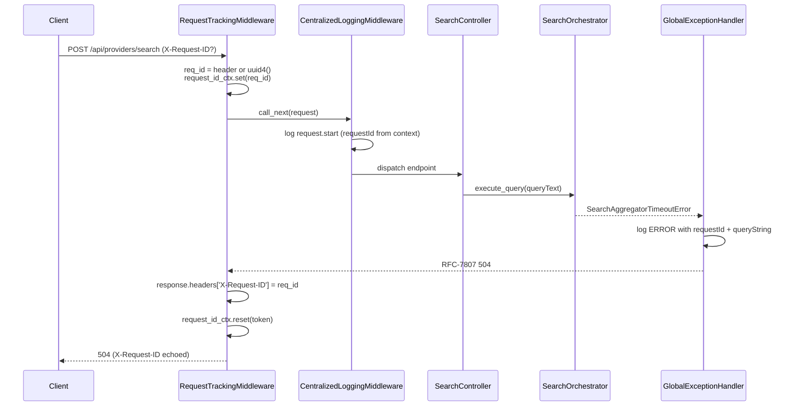
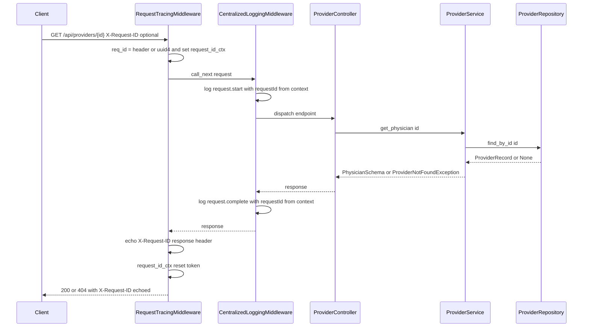
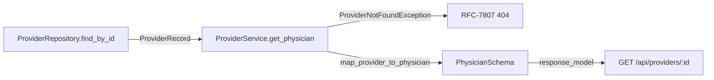
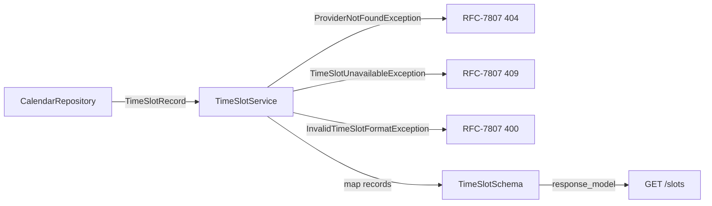
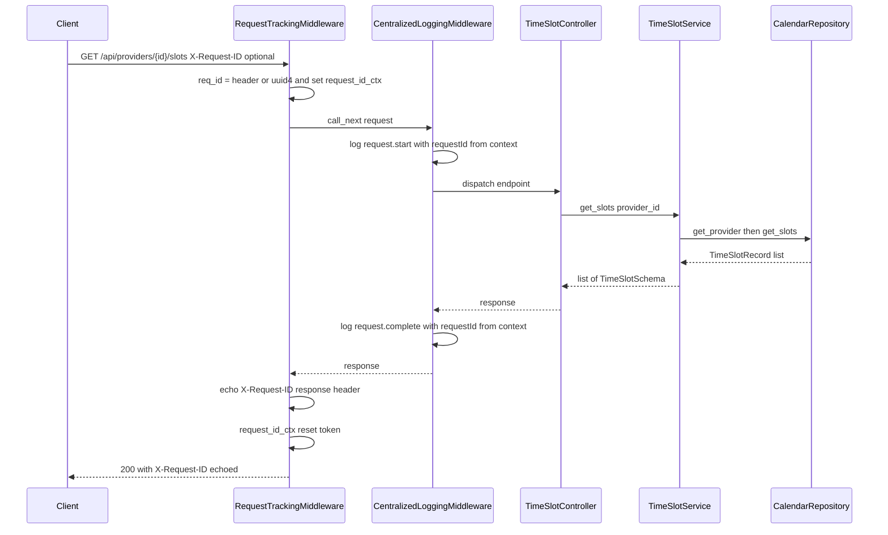
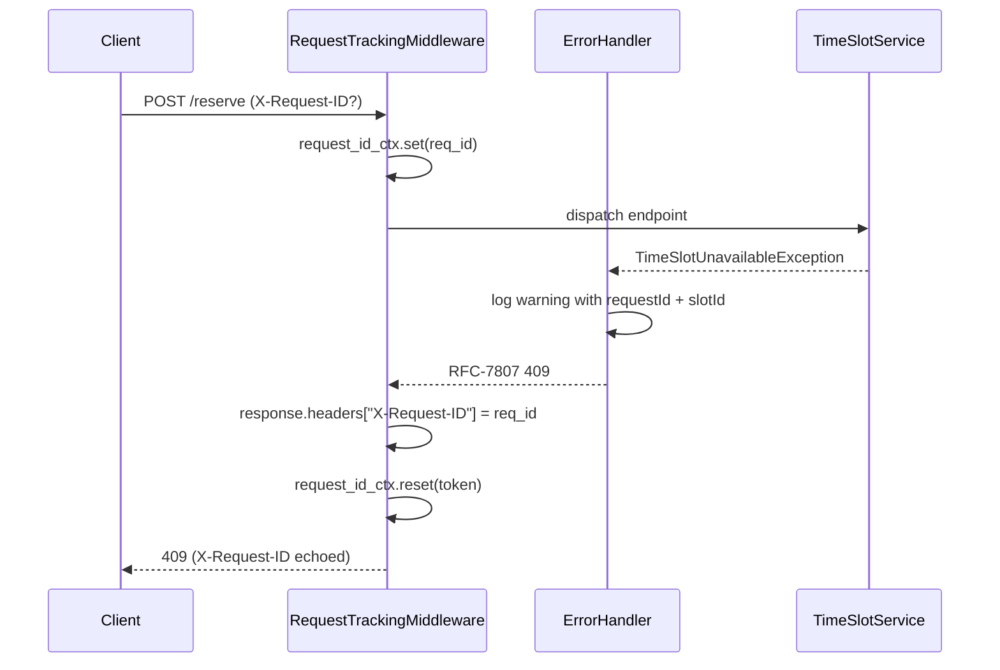
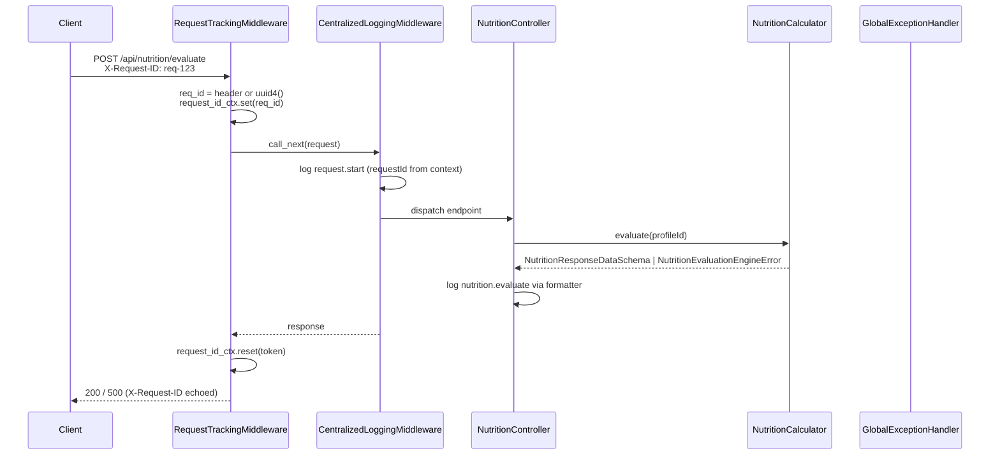
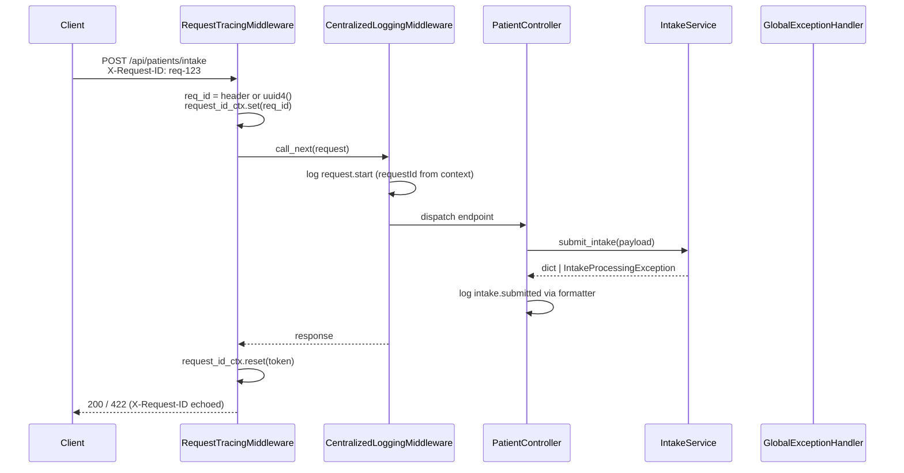

# IOPHA: Technical Design (Low-Level Design)

## Table of Contents

| #   | Section                                                       | Description                                            |
| --- | ------------------------------------------------------------- | ------------------------------------------------------ |
| 1   | [Technology Stack](#1-technology-stack)                       | Frontend, backend, database, and testing technologies  |
| 2   | [Frontend Implementation](#2-frontend-implementation-details) | Styling, logging, state management, performance        |
| 3   | [Backend Implementation](#3-backend-implementation-details)   | Database schema, PII/PHI sanitization, logging, RAG pipeline, global exception handling |
| 3.1 | [Data Access & Persistence](#31-data-access--persistence)     | Repository pattern, in-memory stand-ins, planned SQLAlchemy backend |
| 3.2 | [Provider Discovery API](#32-provider-discovery-api)         | FindDoctorResponseDataSchema, search orchestration, follow-up actions |
| 3.3 | [PII/PHI Sanitization Architecture](#33-piiphi-sanitization-architecture) | Defense-in-depth sanitization across HTTP, logging, and DTO layers |
| 3.4 | [Structured JSON Logging & Auditing](#34-structured-json-logging--auditing) | JSON log format, middleware order, context tracing |
| 3.5 | [RAG Pipeline Logic](#35-rag-pipeline-logic) | Chunking, embeddings, retrieval flow |
| 3.6 | [Global Exception Handling & Runbook Mappings](#36-global-exception-handling--runbook-mappings) | RFC-7807 problem detail, runbook deep-links, exception registry |
| 3.7 | [Provider / Physician Scheduling Core API](#37-provider--physician-scheduling-core-api) | Provider lookup, PhysicianSchema, data conversion |
| 3.8 | [Time Slot Availability API](#38-time-slot-availability-api) | TimeSlotSchema, reservation flow, slot validation |
| 3.9 | [Dynamic Booking Tips & Advice API](#39-dynamic-booking-tips--advice-api) | TipSchema, tips lookup, error handling |
| 3.10 | [Nutrition Response API](#310-nutrition-response-api) | Nutrition evaluation endpoint, NutritionResponseDataSchema, error handling |
| 3.11 | [Patient Intake Profile API](#311-patient-intake-profile-api) | Patient intake endpoint, PatientDataSchema, context tracing, error handling |
| 4   | [Testing Strategy](#4-testing-strategy)                       | Unit, integration, E2E, visual regression, performance |
| 5   | [CI/CD & Deployment](#5-cicd--deployment)                     | GitHub Actions, environment config, local dev          |
| 6   | [Decision Points](#6-decision-points-pending)                 | Pending architectural decisions                        |

## 1. Technology Stack

| Layer      | Technology                        | Version | Status      |
| ---------- | --------------------------------- | ------- | ----------- |
| Frontend   | React                             | 18      | In use      |
| Frontend   | TypeScript                        | 5       | In use      |
| Frontend   | Vite                              | 8       | In use      |
| Frontend   | Tailwind CSS                      | v4      | In use      |
| Frontend   | Cypress                           | Latest  | In use      |
| Backend    | FastAPI                           | 0.139   | In use      |
| Backend    | Uvicorn                           | 0.51    | In use      |
| Backend    | Python                            | 3.11    | In use      |
| Backend    | Pydantic (v2)                     | 2.13    | In use      |
| Backend    | Prometheus FastAPI Instrumentator | 8.0     | In use      |
| Backend    | httpx                             | 0.28    | In use      |
| Backend    | SQLAlchemy                        | Latest  | Pending     |
| Backend    | pytest                            | 9.1     | In use      |
| Backend    | pytest-asyncio                    | 1.4     | In use      |
| Backend    | pytest-cov                        | 7.1     | In use      |
| Backend    | Ruff                              | 0.15    | In use      |
| Backend    | Mypy (strict)                     | 2.2     | In use      |
| Backend    | Bandit                            | 1.9     | In use      |
| Datasource | PostgreSQL + pgvector             | 15      | Pending\*   |

\*Pending: persistence is abstracted behind the `ProviderRepository`
interface; the default `InMemoryProviderRepository` ships today and no
relational datastore is wired. A SQLAlchemy + PostgreSQL + pgvector backend
will replace the in-memory default behind the same interface (see §3.1).

## 2. Frontend Implementation Details

### 2.1 Styling with Tailwind CSS

The frontend uses Tailwind CSS v4 with the IOPHA brand theme (copied from IOPHA Resources):

- Primary color: `#0A6B7C` (teal)
- Accent color: `#D95B3B` (orange)
- Background: `#F3F1EC` (warm off-white)
- All component styling uses Tailwind utility classes via the `cn()` helper (clsx + tailwind-merge)

### 2.2 Logging & Observability

**Custom Logger Class** (`src/utils/logger.ts`):

```typescript
class Logger {
  static debug(message: string, ...args: unknown[]): void;
  static info(message: string, ...args: unknown[]): void;
  static warn(message: string, ...args: unknown[]): void;
  static error(message: string, ...args: unknown[]): void;
}
```

Environment behavior:

- Development: Logs all levels (debug, info, warn, error)
- Production: Suppresses debug, info, warn; only error level emitted

**Namespace Helpers**:

- `app:render`, `app:api`, `app:router` - selective console output for application domains
- No-ops in production builds

**Render-Tracking Hook** (`useLogRenders`):

- Monitors functional component render frequency using `useRef` and `useEffect`
- Logs render count and optional shallow prop snapshot
- Available in `src/hooks/useLogRenders.ts`

**Error Boundaries** (`src/components/AppErrorBoundary.tsx`):

- Uses `react-error-boundary` for functional error boundaries
- Russian Doll pattern: Root → Layout → Feature level isolation
- Structured error logging: message, stack, component stack
- Fallback UI: Localized with "Try again" reset button, no external API calls

### 2.3 State Management & Data Fetching

Strategy:

- Server state: React Query (TanStack Query) or SWR for caching, background updates
- Client state: React Context

### 2.4 Performance Monitoring

**React Profiler Integration**:

- Root-level and route-boundary profiling
- `onRender` callback logs: id, phase, actualDuration, baseDuration, startTime, commitTime

**Performance Hook** (`usePerformanceTracking`):

- Captures render durations via `useRef` and `useLayoutEffect`/`useEffect`
- Warning emitted if render exceeds 16ms (60fps threshold)

**Page Metrics** (`logPagePerformanceMetrics`):

- DNS lookup, TCP connection, TTFB, DOM interactive, DOM loaded, load complete
- First Paint, First Contentful Paint via Paint Timing API

## 3. Backend Implementation Details

### 3.1 Data Access & Persistence

> **Current state:** the backend has **no production database dependency**.
> Data access is abstracted behind the `ProviderRepository` protocol
> (`app/repositories/provider_repository.py`); the default
> `InMemoryProviderRepository` is a pure in-memory stand-in so the scheduling
> pipeline runs, is tested, and passes CI without any datastore. A relational
> backend (SQLAlchemy + PostgreSQL + pgvector) will replace the in-memory
> default behind the same interface — no caller (service, controller) changes
> when that lands.

**Repository Contract** (`app/repositories/provider_repository.py`):

| Member        | Signature                                          | Purpose                                                                 |
| ------------- | -------------------------------------------------- | ----------------------------------------------------------------------- |
| `find_by_id`  | `(provider_id: str) -> ProviderRecord \| None`     | Resolve the internal relational record for a provider id, or `None` if absent (drives the 404 path). |

**Intended Relational Schema** (provisional — not yet implemented; pending the
SQLAlchemy backend described in §1):

| Table          | Purpose                                 |
| -------------- | --------------------------------------- |
| users          | User accounts with role (patient/admin) |
| organizations  | Hospital/health system affiliations     |
| sessions       | Chat session tracking                   |
| messages       | Chat message history                    |
| guidelines     | Clinical guidelines with vector column  |
| ingestion_jobs | Document processing status              |

- Indexes: GIN indexes for full-text search on text columns; IVFFlat/HNSW index for vector similarity search on embeddings.
- `PGVECTOR_DIMENSION` default: 1536 (AWS Bedrock Titan embedding model).

### 3.2 Provider Discovery API

The provider discovery pipeline exposes a natural-language search endpoint that
returns a compound response: a human-readable `summaryText`, a list of matching
`ProviderSchema` records, and a list of `FollowUpActionSchema` chips for
client-side funnel routing.

**Layered Architecture:**

| Layer | Module | Responsibility |
|---|---|---|
| Controller | `app/controllers/providers_search.py` | HTTP surface for `POST /api/providers/search`; validates request, delegates to orchestrator, returns `FindDoctorResponseDataSchema`. |
| Service | `app/services/search_orchestrator.py` | `SearchOrchestrator` ABC + `InMemorySearchOrchestrator` no-backend stand-in. Tests override via `app.dependency_overrides`. |
| Schemas | `app/schemas/find_doctor.py`, `app/schemas/workflows/follow_up_action.py` | `FindDoctorResponseDataSchema`, `ProviderSearchRequest`, `FollowUpActionSchema`. |
| Dependencies | `app/dependencies.py` | `get_search_orchestrator` FastAPI dependency, overridden in tests. |
| Tracing | `app/middleware/request_tracing.py`, `app/core/context.py` | `X-Request-ID` correlation via `contextvars`. |
| Logging | `app/utils/logging.py`, `app/core/logging_config.py` | `JsonTelemetryFormatter` + `CentralizedLoggingMiddleware` + `JSONLogFormatter`. |
| Exceptions | `app/exceptions/domain_errors.py` | `SearchAggregatorTimeoutError` mapped to HTTP 504. |

**FindDoctorResponseDataSchema:**

| Field | Type | Validation | Description |
|---|---|---|---|
| `summaryText` | `str` | `max_length=2000` | Natural language system summary matching the search query result. |
| `providers` | `list[ProviderSchema]` | required | Collection of matching verified healthcare provider entities. |
| `followUpActions` | `list[FollowUpActionSchema]` | required | Action chips coordinating target client funnel redirects. |

Configuration: `model_config = ConfigDict(extra="forbid")` so no unplanned
fields can cross the API boundary.

**FollowUpActionSchema:**

| Field | Type | Validation | Description |
|---|---|---|---|
| `label` | `str` | `max_length=200` | Action chip display text rendered on the client. |
| `actionType` | `str` | `max_length=100` | Enumeration target routing directive for client funnel. |
| `providerId` | `str` | `max_length=100` | Target provider system key binding for action routing. |

Configuration: `model_config = ConfigDict(extra="forbid")`.

**ProviderSearchRequest:**

| Field | Type | Validation | Description |
|---|---|---|---|
| `queryText` | `str` | `min_length=1`, `max_length=500` | Natural language search query string. |

**Route Contract:**

- `POST /api/providers/search` → `FindDoctorResponseDataSchema` (200) or
  RFC-7807 problem (504 `SearchAggregatorTimeoutError`, 422 validation error).

The controller resolves a `SearchController` per request via the
`get_search_controller` factory, which wires
`get_search_orchestrator` → `SearchOrchestrator` → `SearchController`.

**Mock Object Mapping Pattern:**

Tests inject a `MockSearchOrchestrator` via `app.dependency_overrides`. The
mock implements the same `SearchOrchestrator` ABC so the controller remains
oblivious to the test double. The mock supports a `timeout_query` parameter
that raises `SearchAggregatorTimeoutError` for fault-injection tests, and
returns a deterministic `FindDoctorResponseDataSchema` payload for happy-path
tests. The shared mock lives in `tests/integration/_search_test_utils.py` to
avoid duplication across test modules.

**Data Conversion Pathway:**

`MockSearchOrchestrator.execute_query()` returns a plain `dict` that FastAPI
serializes through the `FindDoctorResponseDataSchema` response model. No
internal structural identifiers are emitted because the mock payload contains
only frontend-safe fields.

**Error Handling Flow:**



**Testing Strategy:**

- **Happy path**: `MockSearchOrchestrator` returns a fixed `FindDoctorResponseDataSchema`; assertions verify status 200, schema keys, and nested `ProviderSchema`/`FollowUpActionSchema` fields.
- **Validation**: Missing `queryText` returns 422 with `ProblemDetail`.
- **Context propagation**: `X-Request-ID` is echoed on success and error responses.
- **Leak prevention**: Response bodies are scanned for `Traceback`, `Exception(`, `0x`, `password`, `secret`, `Bearer `, `postgresql`.
- **Dependency isolation**: `app.dependency_overrides` is explicitly cleared in test teardown to prevent stub leakage.

### 3.3 PII/PHI Sanitization Architecture

A defense-in-depth sanitization strategy is implemented across three layers to prevent accidental PHI exposure in logs, metrics, and API responses.

**Layer 1 — HTTP Transport Middleware** (`PIISanitizationMiddleware`):

- Normalizes dynamic URL paths before they reach logging/metrics middleware (e.g., `/patients/12345` → `/patients/:id`)
- Redacts sensitive query parameters (`ssn`, `email`, `phone`, `medical_record_number`)
- Attaches sanitized values to `request.state` for downstream consumers
- Registered **before** logging and metrics middleware to ensure raw paths are never captured

**Layer 2 — Logging Filter** (`PIISanitizerFilter`):

- Uses Python's standard `logging.Filter` attached to the root logger
- Intercepts all `LogRecord` objects before JSON formatter serializes them
- Regex patterns redact email, phone, and SSN from `record.msg`, `record.args`, and `record.extra`
- Handles `record.args` tuple immutability by reconstructing and reassigning the tuple
- Patterns are optimized to prevent catastrophic backtracking in the async event loop

**Layer 3 — Pydantic DTO Serializers**:

- External-facing response models (DTOs) use `@field_serializer` to mask PII fields
- Internal domain models remain unmasked for database operations
- Enforces strict separation between internal and external data representations

**Rationale for DTO Separation**:
Applying `@field_serializer` to internal domain models would mask data needed for database writes and internal business logic. By separating internal models from external DTOs, we ensure serializers only apply at the API boundary.

### 3.4 Structured JSON Logging & Auditing

The backend emits structured JSON logs for every HTTP transaction, enabling direct ingestion by CloudWatch and Elasticsearch without custom parsers.

**Log Key Schema**:

| Field | Type | Description |
|---|---|---|
| `timestamp` | ISO string | Event time in ISO 8601 format |
| `level` | string | Log severity: `INFO`, `WARNING`, `ERROR` |
| `logger` | string | Logger namespace (e.g., `iopha.backend`) |
| `message` | string | Event name (`request.start` or `request.complete`) |
| `requestId` | string | Client-supplied correlation/tracing identifier, propagated as-is |
| `method` | string | HTTP method |
| `path` | string | Sanitized URL path with dynamic segments normalized |
| `userAgent` | string | Client user agent |
| `status` | int | HTTP response status code |
| `durationMs` | int | Request processing duration in milliseconds |
| `responseSize` | int | Response payload size in bytes |
| `queryParams` | object | Sanitized query parameters |
| `exc_info` | string | Exception traceback (present only when an exception is logged) |
| `stack_info` | string | Stack information (present only when explicitly captured) |

**Path-Masking Regular Expressions**:

| Pattern | Replacement | Purpose |
|---|---|---|
| `/patients/\d+` | `/patients/:id` | Normalize patient endpoint cardinality |
| `/providers/\d+` | `/providers/:id` | Normalize provider endpoint cardinality |
| `/sessions/\d+` | `/sessions/:id` | Normalize session endpoint cardinality |
| `/users/\d+` | `/users/:id` | Normalize user endpoint cardinality |

**User ID Masking**:
- Raw format: `user_123456`
- Masked format: `user_***456`
- Rationale: Prevents full user ID exposure in logs while preserving traceability for debugging
- Scope: Applied only to genuinely sensitive user identifiers. Correlation/tracing headers such as `X-Request-ID` are client-supplied and must NOT be masked, as they are required for audit trail traceability across distributed systems.

**Serialization Configuration**:
- Custom `JsonTelemetryFormatter` extends `logging.Formatter`
- Outputs compact JSON via `json.dumps(log_payload, default=str)`
- Attaches to `logging.StreamHandler` for stdout streaming
- Logger namespace: `iopha.backend`

**Middleware Execution Order**:
1. `RequestTracingMiddleware` runs outermost. It reads the inbound `X-Request-ID` header, mints a UUID when absent, and binds the value to the `request_id_ctx` `contextvars.ContextVar` for the request lifetime. The resolved id is echoed on the response `X-Request-ID` header. All downstream logging, services, repositories, and background tasks read the same trace without parameter threading. The token is reset in a `finally` block so the context cannot leak across requests or async tasks.
2. `CentralizedLoggingMiddleware` captures request metadata and logs `request.start`, then logs `request.complete` after all downstream processing completes. Each log line carries `requestId` sourced live from `request_id_ctx` by `JsonTelemetryFormatter`.
3. `PIISanitizationMiddleware` (planned) — path normalization and sensitive query-parameter redaction are designed to run ahead of logging; it is **not yet enabled** in the current build.

**Context-Threaded Tracing Flow** (`app/utils/context.py`, `app/middleware/request_tracing.py`):



### 3.5 RAG Pipeline Logic

**Chunking Strategy**:

- 512-token windows with 10% overlap (51 tokens)
- Text splitter preserves sentence boundaries

**Embedding Model**:

- Amazon Titan Embeddings (`amazon.titan-embed-text-v2:0`) via AWS Bedrock

**Retrieval Flow**:

1. User query encoded to vector
2. Similarity search against guidelines table
3. Top-K results retrieved
4. Fallback to full-text search if vector search fails

### 3.6 Global Exception Handling & Runbook Mappings

The backend installs application-wide FastAPI exception handlers
(`app/utils/handlers.register_exception_handlers`) that intercept domain-specific
faults and any unhandled runtime error. Every handler returns a structured,
diagnostic JSON problem payload and emits a structured JSON log record through
the same `JsonTelemetryFormatter` pipeline as the request middleware.
For scrubbing rules, payload hygiene, and output boundaries, see
[Security Overview](../security/SECURITY.md).

**Error Response Object** (RFC-7807-style problem detail):

| Field | Type | Description |
|---|---|---|
| `title` | string | Client-safe, human-readable fault summary |
| `status` | int | HTTP status code returned to the client |
| `detail` | string | Client-safe explanation; never contains raw trace, memory addresses, DB schemas, or credentials |
| `instance` | string | `request.url.path` of the failing request |
| `help_url` | string | Deep-link into the centralized runbook (`docs/RUNBOOKS.md`) targeting the exact mitigation section |

**Base Runbook URL Scheme**: `GITHUB_RUNBOOK_BASE_URL` in `app/exceptions/domain_errors.py`
points at `docs/RUNBOOKS.md` on the main branch. Each error appends a `#<link>`
fragment (`_help_url`) whose value MUST match the GitHub-generated slug of the
corresponding markdown header (lowercase, spaces → hyphens, punctuation
stripped) or the link 404s.

**Exception-to-Link Routing Map** (registered in `app/exceptions.DOMAIN_EXCEPTIONS`):

| Exception | Status Code | Log Event | Link |
|---|---|---|---|
| `RaceConditionDoubleBookingError` | 409 | `scheduling.race_condition_double_booking` | `race-condition-double-booking` |
| `TimeZoneMismatchError` | 400 | `scheduling.timezone_mismatch` | `time-zone-mismatch` |
| `AvailabilityDriftError` | 409 | `scheduling.availability_drift` | `availability-drift` |
| `OverlappingModifierConflictError` | 409 | `scheduling.overlapping_modifier_conflict` | `overlapping-modifier-conflict` |
| `WebSocketConnectionDropError` | 503 | `chat.websocket_connection_drop` | `websocket-connection-drop` |
| `OutOfOrderMessageDeliveryError` | 409 | `chat.out_of_order_message_delivery` | `out-of-order-message-delivery` |
| `UnreadNotificationInconsistencyError` | 409 | `chat.unread_notification_inconsistency` | `unread-notification-inconsistency` |
| `AttachmentPayloadTooLargeError` | 413 | `chat.attachment_payload_too_large` | `payload-too-large` |
| `ExternalCalendarSyncDisconnectedError` | 502 | `integration.external_calendar_sync_disconnect` | `external-calendar-sync-disconnect` |
| `UpstreamWebhookFailureError` | 502 | `integration.upstream_webhook_failure` | `upstream-webhook-failure` |
| `NotificationGatewayTimeoutError` | 504 | `integration.notification_gateway_timeout` | `notification-gateway-timeout` |
| `InvalidViewTransitionError` | 409 | `state_machine.invalid_view_transition` | `invalid-view-transition` |
| `ExpiredBookingSessionError` | 410 | `state_machine.expired_booking_session` | `expired-booking-session` |
| `ProviderNotFoundException` | 404 | `directory.provider_not_found` | `provider-not-found-error` |
| `TipNotFoundException` | 404 | `tips.tip_not_found` | `tip-not-found-error` |

**Global Catch-All**: A handler registered for base `Exception` returns `500`
with a generic detail and `help_url` link `internal-server-error`. It captures
the full trace server-side via `exc_info=True` but never exposes exception text
to the client.

**Logging Contract**: Structured context is attached via `extra={"extra_context": {...}}`
so the `JsonTelemetryFormatter` serializes it as root-level JSON. The global
handler logs `requestId`, `path`, and `userAgent`; each domain handler logs
`requestId`, `path`, plus only non-sensitive identifiers (slot/patient/session
ids) from `IOPHADomainError.log_context`. All handler logging degrades
gracefully when `X-Request-ID` or `user-agent` headers are missing
(defaulting to `"unknown"`).

**Security Boundaries**: See [Security Overview](../security/SECURITY.md) —
error payloads are scrubbed of credentials and sensitive trace data before
client delivery; raw stack traces exist only in server logs.

## 3.7 Provider / Physician Scheduling Core API

The scheduling resource pipeline establishes the core FastAPI routing engine,
Pydantic contracts, and isolated test scaffolding for the physician/provider
directory modules.

### 3.7.1 Layered Architecture

| Layer | Module | Responsibility |
|---|---|---|
| Controller | `app/controllers/providers.py` | HTTP surface; binds routes, delegates to the service, returns the frontend contract. No persistence or business rules. |
| Service | `app/services/provider_service.py` | Lookup orchestration, mapping, and domain-fault raising (`ProviderNotFoundException`). |
| Repository | `app/repositories/provider_repository.py` | `ProviderRepository` ABC + `InMemoryProviderRepository` no-DB stand-in. |
| Schemas | `app/schemas/` | `PhysicianSchema` (frontend DTO) and `ProviderRecord` (internal relational shape) under `physician/` and `provider/` subpackages. |
| Dependencies | `app/dependencies.py` | `get_provider_repository` FastAPI dependency, overridden in tests. |
| Tracing | `app/middleware/request_tracing.py`, `app/utils/context.py` | `X-Request-ID` correlation via `contextvars`. |
| Logging | `app/utils/logging.py` | `JsonTelemetryFormatter` + `CentralizedLoggingMiddleware`. |

### 3.7.2 Route Contract

- `GET /api/providers/{provider_id}` → `PhysicianSchema` (200) or RFC-7807 problem (404).
- The controller resolves a `ProviderController` per request via the
  `get_provider_controller` factory, which wires `get_provider_repository` →
  `ProviderService` → `ProviderController`.

### 3.7.3 Data Conversion Pathway (Relational → Frontend)

Internal datastore rows arrive as `ProviderRecord` (a `@dataclass` carrying the
relational shape, including the `db_primary_key` structural identifier used only
for persistence). `map_provider_to_physician()` projects only client-safe,
frontend-aligned fields into `PhysicianSchema`. The internal `db_primary_key`
is **deliberately dropped** so it never crosses the API boundary. Both
`PhysicianSchema` uses `model_config = ConfigDict(extra="forbid")`
for rigid, defensive validation of the external contract.



### 3.7.4 Transaction Schema Rules

- Frontend DTOs use camelCase field names dictated by the API contract
  (`reviewCount`, `nextAvailable`, `imageUrl`); these are intentional and
  excluded from N815 lint enforcement on `app/schemas/**`.
- Internal `ProviderRecord` is never serialized directly to clients.
- Structural identifiers and credentials are never placed in the response body
  or in `extra_context` log payloads.

## 3.8 Time Slot Availability API

The time-slot resource pipeline extends the core scheduling engine with a
provider-availability endpoint, Pydantic slot contracts, request-tracing
middleware, structured JSON logging, PHI scrubbing, and RFC-7807 error
handling.

### 3.8.1 Layered Architecture

| Layer | Module | Responsibility |
|---|---|---|
| Controller | `app/controllers/timeslots.py` | HTTP surface for `GET /api/providers/{provider_id}/slots` and `POST /api/providers/{provider_id}/slots/{id}/reserve`. |
| Service | `app/services/timeslot_service.py` | Lookup orchestration, slot validation, and domain-fault raising. |
| Repository | `app/repositories/calendar_repository.py` | `CalendarRepository` ABC + `InMemoryCalendarRepository` no-DB stand-in. |
| Schemas | `app/schemas/timeslot.py` | `TimeSlotSchema` (frontend DTO) and `TimeSlotRecord` (internal shape). |
| Dependencies | `app/dependencies.py` | `get_calendar_repository` FastAPI dependency, overridden in tests. |
| Tracing | `app/middleware/request_tracing.py`, `app/core/context.py` | `X-Request-ID` correlation via `contextvars`. |
| Logging | `app/utils/logging.py`, `app/core/logging_config.py` | `JsonTelemetryFormatter` + `CentralizedLoggingMiddleware` + `JSONLogFormatter`. |
| PHI Scrubbing | `app/core/phi_scrubber.py` | Redacts PII/PHI from log messages before serialization. |
| Exceptions | `app/exceptions/timeslot_exceptions.py` | Domain exceptions mapped to HTTP status codes. |
| Error Handlers | `app/api/error_handlers.py` | RFC-7807 problem detail responses with runbook deep-links. |

### 3.8.2 TimeSlotSchema

The external contract returned by the availability API (`TimeSlotSchema`):

| Field | Type | Validation | Description |
|---|---|---|---|
| `id` | `str` | Pattern: `^\d{4}-\d{2}-\d{2}-(0[1-9]|1[0-2]):[0-5][0-9] (AM|PM)$` | Unique slot key embedding ISO date + civil time (e.g. `2024-01-15-09:00 AM`). |
| `time` | `str` | Pattern: `^(0[1-9]|1[0-2]):[0-5][0-9] (AM|PM)$` | Display time in 12-hour civil format (e.g. `09:00 AM`). |
| `label` | `str` | None | Human-readable label rendered on the slot button. |
| `available` | `bool` | None | Whether the slot can still be booked. |

Configuration: `model_config = ConfigDict(extra="forbid")` so no unplanned
fields can cross the API boundary.

Validation helpers:

- `TimeSlotSchema.is_valid_time(value) -> bool` — validates civil time pattern.
- `TimeSlotSchema.is_valid_slot_id(value) -> bool` — validates composite slot-id pattern.

### 3.8.3 Route Contract

- `GET /api/providers/{provider_id}/slots` → `list[TimeSlotSchema]` (200) or
  RFC-7807 problem (404 `ProviderNotFoundException`).
- `POST /api/providers/{provider_id}/slots/{slot_id}/reserve` → `{"status":
  "reserved", "slot_id": str}` (200) or RFC-7807 problem (409
  `TimeSlotUnavailableException`, 400 `InvalidTimeSlotFormatException`).

The controller resolves a `TimeSlotController` per request via the
`get_timeslot_controller` factory, which wires
`get_calendar_repository` → `TimeSlotService` → `TimeSlotController`.

### 3.8.4 Data Conversion Pathway

`TimeSlotRecord` (internal repository shape with `id`, `time`, `label`,
`available`) is projected into `TimeSlotSchema` inside
`TimeSlotService.get_slots()`. No structural identifiers leak because the
internal record contains only slot attributes.



### 3.8.5 Middleware & Logging Stack

The availability API runs inside the same middleware stack as the directory
API, with the ticket-named `RequestTrackingMiddleware` subclass registered
under the availability resource.

**Middleware:**

1. `RequestTrackingMiddleware` — outermost. Reads inbound `X-Request-ID` or
   mints a UUID; binds to `request_id_ctx` `ContextVar`; echoes on response
   header; resets in `finally` to prevent context leaks.
2. `CentralizedLoggingMiddleware` — logs `request.start` and `request.complete`
   with method, path, status, and duration.
3. `ProblemAPIRoute` — catches `RequestValidationError` and projects it into
   a `ProblemDetail` (RFC-7807) payload.
4. `register_timeslot_error_handlers` — maps slot-domain exceptions to their
   corresponding HTTP status codes and problem payloads.

**Logging formatters:**

1. `JsonTelemetryFormatter` / `JSONLogFormatter` — serializes logs as compact
   JSON, scrubbing PHI via `PHIScrubber`.

### 3.8.6 Exception Hierarchy & Handling Flow

All availability exceptions inherit from `AppBaseException`, which itself
inherits from `IOPHADomainError`. The base class provides `status_code = 500`,
`log_level = ERROR`, and a `log_context()` hook.

| Exception | Status | Log Event | Link |
|---|---|---|---|
| `TimeSlotUnavailableException` | 409 | `timeslot.unavailable` | `time-slot-unavailable` |
| `ProviderNotFoundException` | 404 | `directory.provider_not_found` | `provider-not-found-error` |
| `InvalidTimeSlotFormatException` | 400 | `timeslot.invalid_format` | `invalid-time-slot-format` |

Each exception stores a single non-sensitive identifier (`slot_id` or
`provider_id` or `details`). `safe_detail()` returns a client-safe string.
`log_context()` returns a dict of those non-sensitive identifiers, which the
error handler injects into the structured log record under
`extra={"extra_context": ...}`.

The global catch-all handler (`Exception`) returns 500 with a generic detail
and `help_url` link `internal-server-error`; raw traces are captured
server-side only via `exc_info=True` and never exposed to the client.

### 3.8.7 Request Tracking Lifecycle



On fault:



## 3.9 Dynamic Booking Tips & Advice API

The tips resource extends the core scheduling engine with a booking-advice
tips endpoint, ``TipSchema`` contract, and RFC-7807 error handling.

### 3.9.1 Layered Architecture

| Layer | Module | Responsibility |
|---|---|---|
| Controller | `app/controllers/tips.py` | HTTP surface for `GET /api/tips` (list) and `GET /api/tips/{tip_id}` (single). |
| Service | `app/services/tips_service.py` | Lookup orchestration and domain-fault raising (`TipNotFoundException`). |
| Repository | `app/repositories/tips_repository.py` | `TipsRepository` ABC + `InMemoryTipsRepository` no-DB stand-in. |
| Schemas | `app/schemas/tip.py` | `TipSchema` (frontend DTO). |
| Dependencies | `app/dependencies.py` | `get_tips_repository` FastAPI dependency, overridden in tests. |
| Tracing | `app/middleware/tracking.py`, `app/core/context.py` | `X-Request-ID` correlation via `contextvars`. |
| Logging | `app/utils/logging.py`, `app/core/logging_config.py` | `JsonTelemetryFormatter` + `CentralizedLoggingMiddleware` + `JSONLogFormatter`. |
| Exceptions | `app/exceptions/domain_errors.py` | `TipNotFoundException` mapped to HTTP 404. |
| Error Handlers | `app/utils/handlers.py` | RFC-7807 problem detail via `register_exception_handlers`. |

### 3.9.2 TipSchema

The external contract returned by the tips API (`TipSchema`):

| Field | Type | Validation | Description |
|---|---|---|---|
| `id` | `str \| None` | Optional; e.g. `tip-001` | Unique tip reference token (absent for not-yet-persisted tips). |
| `number` | `int` | `ge=1` | Ordered indexing digit for card stacking. |
| `title` | `str` | `min_length=1` | Actionable summary headline. |
| `description` | `str` | `min_length=1` | Elaborated body text with behavioral guidance. |

Configuration: `model_config = ConfigDict(extra="forbid")` so no unplanned
fields can cross the API boundary.

### 3.9.3 Route Contract

- `GET /api/tips` → `list[TipSchema]` (200) or RFC-7807 problem
  (422 on invalid `limit`).
- `GET /api/tips/{tip_id}` → `TipSchema` (200) or RFC-7807 problem
  (404 `TipNotFoundException`).

The controller resolves a `TipsController` per request via the
`get_tips_controller` factory, which wires `get_tips_repository` →
`TipsService` → `TipsController`.

### 3.9.4 Exception Hierarchy & Handling Flow

`TipNotFoundException` inherits directly from `IOPHADomainError` (the same
base as the scheduling/time-slot exceptions) and is registered in
`DOMAIN_EXCEPTIONS`, so the single global handler in
`app/utils/handlers.py` (`register_exception_handlers`) intercepts it
automatically — no resource-specific registration is required.

| Exception | Status | Log Event | Link |
|---|---|---|---|
| `TipNotFoundException` | 404 | `tips.tip_not_found` | `tip-not-found-error` |

The handler emits a structured `ProblemDetail` payload (`title`, `status`,
`detail`, `instance`, `help_url`, `requestId`) and logs `requestId`,
`path`, and `tipId` (from `log_context()`) via the same
`JsonTelemetryFormatter` pipeline as the request middleware. The
`X-Request-ID` correlation id is echoed on the response header and
matches the logged `requestId`, preserving the audit trail.

### 3.10 Nutrition Response API

The nutrition resource extends the core scheduling engine with a nutrition
evaluation endpoint, the `NutritionResponseDataSchema` contract, a
field validator enforcing an exact tip cardinality, and RFC-7807 error
handling via the shared global exception pipeline.

#### 3.10.1 Layered Architecture

| Layer | Module | Responsibility |
| --- | --- | --- |
| Controller | `app/controllers/nutrition.py` | HTTP surface for `POST /api/nutrition/evaluate`; validates the request body and returns `NutritionResponseDataSchema`. |
| Service | `app/services/nutrition_service.py` | `NutritionCalculator` ABC + `InMemoryNutritionCalculator` no-backend stand-in. |
| Schemas | `app/schemas/nutrition_response.py` | `NutritionResponseDataSchema` (frontend DTO) + `NutritionEvaluateRequest` (inbound). |
| Dependencies | `app/dependencies.py` | `get_nutrition_calculator` FastAPI dependency, overridden in tests. |
| Tracing | `app/middleware/tracking.py`, `app/core/context.py` | `X-Request-ID` correlation via `contextvars`. |
| Logging | `app/utils/logging.py`, `app/core/logging_config.py` | `JsonTelemetryFormatter` + `CentralizedLoggingMiddleware`. |
| Exceptions | `app/exceptions/nutrition_exceptions.py` | `NutritionEvaluationEngineError` mapped to HTTP 500. |
| Error Handlers | `app/utils/handlers.py` | RFC-7807 problem detail via `register_exception_handlers`. |

#### 3.10.2 NutritionResponseDataSchema

The external contract returned by the nutrition API (`NutritionResponseDataSchema`):

| Field | Type | Validation | Description |
| --- | --- | --- | --- |
| `introText` | `str` | `max_length=2000` | Introductory clinical overview for the nutrition response. |
| `tips` | `list[TipSchema]` | **exactly 3 entries** | Ordered behavioral dietary tip cards. |
| `physician` | `PhysicianSchema \| None` | optional | Optional physician recommendation. |
| `followUpChips` | `list[str]` | required | Actionable workflow chips. |

Configuration: `model_config = ConfigDict(extra="forbid")` so no unplanned
fields can cross the API boundary.

**Cardinality validator** (`_validate_exact_tip_count`):

```python
@field_validator("tips")
@classmethod
def _validate_exact_tip_count(cls, value: list[TipSchema]) -> list[TipSchema]:
    if len(value) != 3:
        raise ValueError("Tips collection must contain exactly 3 entries")
    return value
```

The validator enforces the **exact-tip-count** contract: the response
carries precisely three `TipSchema` cards. A payload arriving with two or
four tips fails validation and is rejected with the RFC-7807
`unprocessable-entity-error` problem (422) before any serialization.

#### 3.10.3 Route Contract

- `POST /api/nutrition/evaluate` → `NutritionResponseDataSchema` (200) or RFC-7807 problem (422 validation error, 500 `NutritionEvaluationEngineError`).
- The controller resolves a `NutritionController` per request via the
  `get_nutrition_controller` factory, which wires
  `get_nutrition_calculator` → `NutritionCalculator` → `NutritionController`.

#### 3.10.4 Exception Hierarchy & Handling Flow

`NutritionEvaluationEngineError` inherits directly from `IOPHADomainError`
(the same base as the scheduling/time-slot/tips exceptions) and is
registered in `DOMAIN_EXCEPTIONS`, so the single global handler in
`app/utils/handlers.py` (`register_exception_handlers`) intercepts it
automatically — no resource-specific registration is required.

| Exception | Status | Log Event | Link |
| --- | --- | --- | --- |
| `NutritionEvaluationEngineError` | 500 | `nutrition.evaluation_engine_error` | `nutrition-evaluation-error` |

The handler emits a structured `ProblemDetail` payload (`title`, `status`,
`detail`, `instance`, `help_url`, `requestId`) and logs `requestId`,
`path`, and any non-sensitive identifiers from `log_context()` via the
same `JsonTelemetryFormatter` pipeline as the request middleware.

#### 3.10.5 Context-Tracing Flow

The nutrition endpoint rides the **shared** request-tracing infrastructure
rather than declaring its own middleware:

1. `RequestTrackingMiddleware` (`app/middleware/tracking.py`)
   reads the inbound `X-Request-ID` header (minting a UUID when
   absent), binds it to the `request_id_ctx` `contextvars.ContextVar`,
   and echoes it back on the response header. Every downstream log
   line reads the same correlation id without parameter threading.
2. `CentralizedLoggingMiddleware` (`app/utils/logging.py`) logs
   `request.start` / `request.complete` with `requestId` sourced
   live from `request_id_ctx` by `JsonTelemetryFormatter`.
3. `NutritionController.evaluate` emts the nutrition-specific
   `nutrition.evaluate` log; the `JsonTelemetryFormatter` attaches
   `requestId` from the propagated `request_id_ctx` automatically, so
   the event correlates to the same request trace as the
   middleware/exception records. **No patient/profile identifier is
   logged** (HIPAA minimum-necessary: raw `profileId` is never
   written to logs).



### 3.11 Patient Intake Profile API

The patient intake profile pipeline establishes the core FastAPI routing
mechanics, Pydantic validation contracts, and isolated test scaffolding for
the appointment intake forms. It processes highly sensitive customer
attributes (names, contact vectors, medical visit reasoning) and must apply
rigorous sanitation filters before any diagnostic traces are emitted.

#### 3.11.1 Layered Architecture

| Layer | Module | Responsibility |
| --- | --- | --- |
| Controller | `app/controllers/intake.py` | HTTP surface for `POST /api/patients/intake`; validates request, delegates to service, returns processing status. |
| Service | `app/services/intake_service.py` | `IntakeService` ABC + `InMemoryIntakeService` no-backend stand-in. Tests override via `app.dependency_overrides`. |
| Schemas | `app/schemas/patient/patient_data.py` | `PatientDataSchema` (inbound Pydantic contract with strict validation). |
| Dependencies | `app/dependencies.py` | `get_intake_service` FastAPI dependency, overridden in tests. |
| Tracing | `app/middleware/request_tracing.py`, `app/core/context.py` | `X-Request-ID` correlation via `contextvars`. |
| Logging | `app/utils/logging.py`, `app/core/logging_config.py` | `JsonTelemetryFormatter` + `CentralizedLoggingMiddleware` + `JSONLogFormatter`. |
| Exceptions | `app/exceptions/intake_exceptions.py` | `IntakeProcessingException` mapped to HTTP 422. |
| Error Handlers | `app/utils/handlers.py` | RFC-7807 problem detail via `register_exception_handlers`. |

#### 3.11.2 PatientDataSchema

The external inbound contract for the intake endpoint (`PatientDataSchema`):

| Field | Type | Validation | Description |
| --- | --- | --- | --- |
| `name` | `str` | `min_length=1`, `max_length=100` | Full name of the submitting patient. |
| `email` | `str` | regex pattern | Valid email format (standard communications target). |
| `reason` | `str \| None` | `max_length=500` | Optional patient-provided intake reason context. |
| `phone` | `str` | field validator | 10-digit primary telephone contact key; non-digit characters are stripped before validation. |

Configuration: `model_config = ConfigDict(extra="forbid")` so no unplanned
fields can cross the API boundary.

**Phone validator** (`validate_ten_digit_phone`):

```python
@field_validator("phone")
@classmethod
def validate_ten_digit_phone(cls, value: str) -> str:
    cleaned = re.sub(r"\D", "", value)
    if len(cleaned) != PHONE_DIGIT_COUNT:
        raise ValueError("Phone number must contain exactly 10 numerical digits.")
    return cleaned
```

The validator enforces clean text constraints over incoming phone attributes,
ensuring that exactly 10 digits are supplied without characters or spacers.
Non-digit characters are stripped before length validation so formatted inputs
(e.g. `(555) 123-4567`) are normalized.

#### 3.11.3 Route Contract

- `POST /api/patients/intake` → `dict` (200) or RFC-7807 problem
  (422 `IntakeProcessingException`, 422 validation error).

The controller resolves a `PatientController` per request via the
`get_patient_controller` factory, which wires
`get_intake_service` → `IntakeService` → `PatientController`.

#### 3.11.4 Exception Hierarchy & Handling Flow

`IntakeProcessingException` inherits directly from `IOPHADomainError` (the
same base as the scheduling/time-slot/tips/nutrition exceptions) and is
registered in `DOMAIN_EXCEPTIONS`, so the single global handler in
`app/utils/handlers.py` (`register_exception_handlers`) intercepts it
automatically — no resource-specific registration is required.

| Exception | Status | Log Event | Link |
| --- | --- | --- | --- |
| `IntakeProcessingException` | 422 | `intake.processing_failure` | `intake-processing-error` |

The handler emits a structured `ProblemDetail` payload (`title`, `status`,
`detail`, `instance`, `help_url`, `requestId`) and logs `requestId`,
`path` via the same `JsonTelemetryFormatter` pipeline as the request
middleware. The `X-Request-ID` correlation id is echoed on the response
header and matches the logged `requestId`, preserving the audit trail.

#### 3.11.5 Context-Tracing Flow

The intake endpoint rides the **shared** request-tracing infrastructure
rather than declaring its own middleware:

1. `RequestTracingMiddleware` (`app/middleware/request_tracing.py`)
   reads the inbound `X-Request-ID` header (minting a UUID when
   absent), binds it to the `request_id_ctx` `contextvars.ContextVar`,
   and echoes it back on the response header. Every downstream log
   line reads the same correlation id without parameter threading.
2. `CentralizedLoggingMiddleware` (`app/utils/logging.py`) logs
   `request.start` / `request.complete` with `requestId` sourced
   live from `request_id_ctx` by `JsonTelemetryFormatter`.
3. `PatientController.submit_intake` emits the intake-specific
   `intake.submitted` log; the `JsonTelemetryFormatter` attaches
   `requestId` from the propagated `request_id_ctx` automatically, so
   the event correlates to the same request trace as the
   middleware/exception records. No patient/profile identifier is
   logged (HIPAA minimum-necessary: raw PII is never written to logs).



#### 3.11.6 Mock-Object Mapping Patterns

Tests inject a mock `IntakeService` via `app.dependency_overrides`. The
mock implements the same `IntakeService` ABC so the controller remains
oblivious to the test double. The mock supports a fault-injection path
that raises `IntakeProcessingException` for error-handling tests, and
returns a deterministic success payload for happy-path tests.

**Isolation rules:**
- The mock is injected per-test via a fixture that clears the override in
  teardown using `app.dependency_overrides.pop(get_intake_service, None)`.
- No real patient data, PII, or downstream service credentials are
  embedded in the mock payload.
- The mock supports fault injection to verify that the global exception
  handler returns a scrubbed RFC-7807 payload with a runbook `help_url`.

### 3.12 Booking Orchestration & Calendar Slots Discovery API

The booking orchestration layer converges the aggregate slot locator and the
stateful allocation writer endpoint. It exposes a composite request schema that
nests :class:`PatientDataSchema`, a day-scoped calendar discovery response, and
a structured booking creation response.

#### 3.12.1 Layered Architecture

| Layer | Module | Responsibility |
| --- | --- | --- |
| Controller | `app/controllers/booking.py` | HTTP surface for `POST /api/bookings`; validates composite payload, delegates to service, returns `BookingResponseSchema`. |
| Controller | `app/controllers/timeslots.py` | HTTP surface for `GET /api/providers/{provider_id}/slots`; parses `date` query, delegates to service, returns `CalendarSlotsResponseSchema`. |
| Service | `app/services/booking_service.py` | `BookingService` ABC + `InMemoryBookingService` no-backend stand-in. Orchestrates provider lookup, slot validation, atomic reservation, and booking persistence. |
| Repository | `app/repositories/booking_repository.py` | `BookingRepository` ABC + `InMemoryBookingRepository` no-DB stand-in for confirmed bookings. |
| Schemas | `app/schemas/booking.py` | `BookingRequestSchema`, `BookingResponseSchema`, `BookingSummarySchema`, `CalendarSlotsResponseSchema`. |
| Dependencies | `app/dependencies.py` | `get_booking_service`, `get_booking_repository` FastAPI dependencies, overridden in tests. |
| Tracing | `app/middleware/request_tracing.py`, `app/core/context.py` | `X-Request-ID` correlation via `contextvars`. |
| Logging | `app/utils/logging.py`, `app/core/logging_config.py` | `JsonTelemetryFormatter` + `CentralizedLoggingMiddleware` + `JSONLogFormatter`. |
| PHI Scrubbing | `app/core/phi_scrubber.py` | Redacts PII/PHI from log messages before serialization. |
| Exceptions | `app/exceptions/timeslot_exceptions.py` | `ScheduleLockConflictException` mapped to HTTP 409. |
| Error Handlers | `app/exceptions/error_handlers.py` | RFC-7807 problem detail responses with runbook deep-links. |

#### 3.12.2 Booking Schemas

**BookingRequestSchema**

| Field | Type | Validation | Description |
| --- | --- | --- | --- |
| `providerId` | `str` | required | Target provider entity reference identifier. |
| `slotId` | `str` | required | Selected time slot allocation block key. |
| `patientData` | `PatientDataSchema` | required | Nested PII/PHI intake attributes validation sub-block. |

**BookingResponseSchema**

| Field | Type | Validation | Description |
| --- | --- | --- | --- |
| `bookingId` | `str` | required | Centralized database reservation primary key reference. |
| `summary` | `BookingSummarySchema` | required | Nested metadata block characterizing the confirmed event. |

**BookingSummarySchema**

| Field | Type | Validation | Description |
| --- | --- | --- | --- |
| `physician` | `PhysicianSchema` | required | Sanitized provider profile summary mapping. |
| `date` | `date` | required | Confirmed appointment date component. |
| `time` | `str` | required | Display format of the confirmed slot time, e.g. "04:00 PM". |

**CalendarSlotsResponseSchema**

| Field | Type | Validation | Description |
| --- | --- | --- | --- |
| `date` | `date` | required | Target query date formatted as YYYY-MM-DD. |
| `slots` | `list[TimeSlotSchema]` | required | Array of historical and active calendar node availabilities. |

All external schemas use `model_config = ConfigDict(extra="forbid")` so no
unplanned fields can cross the API boundary.

#### 3.12.3 Route Contract

- `POST /api/bookings` → `BookingResponseSchema` (201) or RFC-7807 problem
  (400 invalid slot format, 404 provider not found, 409 slot unavailable or
  schedule lock conflict, 422 validation error).
- `GET /api/providers/{provider_id}/slots?date=YYYY-MM-DD` →
  `CalendarSlotsResponseSchema` (200) or RFC-7807 problem (404 provider not
  found, 422 invalid date).

The booking controller resolves a `BookingController` per request via the
`get_booking_controller` factory, which wires `get_booking_service` →
`BookingService` → `BookingController`.

The time-slot controller resolves a `TimeSlotController` per request via the
`get_timeslot_controller` factory, which wires `get_calendar_repository` →
`TimeSlotService` → `TimeSlotController`.

#### 3.12.4 Data Conversion Pathway

For booking creation, the service:

1. Validates the composite `slotId` against `TimeSlotSchema.SLOT_ID_PATTERN`.
2. Resolves the provider via `ProviderRepository`.
3. Confirms the slot exists and is available in the calendar.
4. Attempts an atomic reservation through `CalendarRepository.reserve_slot`.
5. Persists the booking via `BookingRepository.create`.
6. Maps the internal `ProviderRecord` to `PhysicianSchema` and returns the
   `BookingResponseSchema`.

If `reserve_slot` returns `False` (race condition), the service raises
`ScheduleLockConflictException`, which the dedicated handler maps to a 409
RFC-7807 problem with a `schedule-lock-conflict` runbook link.

For calendar discovery, the service filters the provider's calendar slots to
those whose composite `id` starts with the requested ISO date and returns them
wrapped in `CalendarSlotsResponseSchema`.

#### 3.12.5 Middleware & Logging Stack

Both endpoints ride the shared request-tracing and structured logging
infrastructure:

1. `RequestTrackingMiddleware` / `RequestTracingMiddleware` — outermost. Reads
   inbound `X-Request-ID` or mints a UUID; binds to `request_id_ctx`;
   echoes on response header; resets in `finally`.
2. `CentralizedLoggingMiddleware` — logs `request.start` and
   `request.complete` with method, path, status, and duration.
3. `ProblemAPIRoute` — catches `RequestValidationError` and projects it into
   a `ProblemDetail` (RFC-7807) payload.
4. `register_timeslot_error_handlers` + global `register_exception_handlers` —
   map domain exceptions to their corresponding HTTP status codes and problem
   payloads.

The booking service emits a `booking.created` structured log event carrying
`bookingId`, `providerId`, and `slotId`. Patient PII (`name`, `email`, `phone`,
`reason`) is never included in the log context; the `JsonTelemetryFormatter`
also runs the message through `PHIScrubber` as a defense-in-depth measure.

#### 3.12.6 Exception Hierarchy & Handling Flow

| Exception | Status | Log Event | Link |
| --- | --- | --- | --- |
| `InvalidTimeSlotFormatException` | 400 | `timeslot.invalid_format` | `invalid-time-slot-format` |
| `ProviderNotFoundException` | 404 | `directory.provider_not_found` | `provider-not-found-error` |
| `TimeSlotUnavailableException` | 409 | `timeslot.unavailable` | `time-slot-unavailable` |
| `ScheduleLockConflictException` | 409 | `scheduling.lock_conflict` | `schedule-lock-conflict` |

#### 3.12.7 Testing Strategy

- **Happy path**: `POST /api/bookings` with a valid composite payload returns
  201 with `bookingId` and `summary`.
- **Calendar discovery**: `GET /api/providers/{provider_id}/slots?date=...`
  returns 200 with `date` and `slots`.
- **Validation**: Missing `patientData`, invalid email, or malformed `slotId`
  returns 422/400 RFC-7807 problems.
- **Fault injection**: Mock `BookingService` raises `TimeSlotUnavailableException`,
  `ProviderNotFoundException`, and `ScheduleLockConflictException`; the global
  handlers return scrubbed RFC-7807 payloads with runbook `help_url` and echo
  `X-Request-ID`.
- **Double-booking**: Shared in-memory repositories demonstrate that a second
  booking attempt on the same slot fails with 409.
- **Leak prevention**: Response bodies and captured log records are scanned for
  patient PII and leak markers (`Traceback`, `Exception(`, `0x`, `password`,
  `secret`, `Bearer `, `postgresql`).

### 4.1 Unit Tests

- Framework: pytest
- Coverage target: 80%

### 4.2 Integration Tests

- FastAPI `TestClient` drives all API routes against the in-process `app`
- No production datastore: the repository dependency is overridden per test
  (`get_calendar_repository` for time slots, `get_provider_repository` for
  providers), so the endpoint is exercised end-to-end against an in-memory double
- Time-slot endpoints are validated for success, 404, 400, and 409 RFC-7807
  problem paths

### 4.3 E2E Tests

- Framework: Cypress with Cucumber Preprocessor
- Browsers: Chrome, Firefox, Edge (matrix strategy)
- `fail-fast: false` for full browser coverage

### 4.4 Visual Regression Tests

- Tool: cypress-image-diff-js
- Artifacts: `cypress-visual-screenshots/`, `cypress-visual-report/`
- Auto-excluded via `.gitignore`

### 4.5 Testing Infrastructure

**Test Dependencies**:
- **pytest**: Test runner with plugin ecosystem
- **pytest-asyncio**: Async test support with `asyncio_mode = "auto"`
- **pytest-cov**: Coverage measurement with reporting (XML, HTML, terminal)
- **httpx**: HTTP client for TestClient transport
- **coverage**: Core coverage measurement library (installed via pytest-cov)
- Configuration in `IOPHA-backend/requirements.txt` and `IOPHA-backend/pyproject.toml`

**Pytest Configuration**:
- `testpaths = ["tests/unit", "tests/e2e", "tests/integration"]`
- `python_files = ["test_*.py"]`
- `asyncio_mode = "auto"` for automatic async loop handling

**Coverage Configuration** (`IOPHA-backend/pyproject.toml`):

| Setting | Value | Purpose |
|---------|-------|---------|
| `source` | `["app"]` | Measure coverage only for the application package |
| `branch` | `true` | Track branch coverage (if/else paths) |
| `fail_under` | `80` | Minimum coverage percentage required to pass |
| `show_missing` | `true` | Display line numbers of uncovered lines in report |
| `exclude_lines` | pragmas, `__repr__`, `NotImplementedError`, `__main__`, `TYPE_CHECKING` | Exclude boilerplate from coverage |

**Coverage Commands**:

```bash
# Run tests with coverage report in terminal
pytest tests --cov=app --cov-report=term

# Run tests with XML and HTML reports
pytest tests --cov=app --cov-report=xml --cov-report=html

# Run all CI checks (used in GitHub Actions)
pytest tests --doctest-modules --junitxml=junit/test-results.xml --cov=app --cov-report=xml --cov-report=html
```

**Asset Lifecycle Patterns**:
- Repository isolation: override the relevant factory (`get_calendar_repository` for time slots, `get_provider_repository` for providers) via `app.dependency_overrides` and clear it in teardown (no datastore touched)
- External services: override via dependency injection, not network mocking
- Test data: factory-generated, deterministic, and isolated per test case

**Backend Test Reporting**:
- JUnit XML: `junit/test-results.xml` for CI test result ingestion
- Coverage reports: XML (`coverage.xml`) and HTML (`htmlcov/`) generated via `pytest-cov`
- Target coverage: 80%
- Coverage scope: `--cov=app` (application package)

### 4.6 Code Quality & Linting

**Backend Linting & Type Checking**:

- **Ruff**: Fast Rust-based linter with Pyflakes (F), Pycodestyle (E/W), isort (I), Pydocstyle (N), Bandit Security (S), Bugbear (B), and Pylint Refactoring (PLR) rules
- **Mypy**: Static type checker with strict mode enabled (disallow_untyped_defs, warn_return_any, etc.)
- Configuration in `IOPHA-backend/pyproject.toml`

**For more information, read the security document.** ([docs/security/SECURITY.md](security/SECURITY.md))

**ESLint Configuration**:

- Version: ESLint 9.x (flat config format)
- Config file: `eslint.config.js` (replaces deprecated `.eslintrc.cjs`)
- TypeScript support: `@typescript-eslint/parser` and `@typescript-eslint/eslint-plugin`
- TanStack Query plugin: `@tanstack/eslint-plugin-query` for exhaustive-deps rule
- Ignores: `node_modules/`, `dist/`, `cypress/`

**Lint Script**:

```bash
npm run lint
# Executes: eslint src --max-warnings=0
```

**Pre-commit Hooks**:

- Husky pre-commit hook runs ESLint with `--fix` on staged `.ts` and `.tsx` files
- Pre-push hook runs: lint, duplicate step check, E2E tests, component tests, and security audit

\*\*IMPORTANT: Never bypass hooks with `--no-verify` or any other mechanism. All hooks must run to catch errors locally before they reach CI. The pre-push hook runs the same checks as GitHub Actions (lint, E2E tests, component tests, security audit). If a hook fails, fix the underlying issue instead of attempting to bypass it.

### 4.7 CI Integration

- Tests run on every PR to main
- JUnit XML and coverage reports uploaded as artifacts
- Screenshots uploaded as artifacts on failure

## 5. CI/CD & Deployment

### 5.1 GitHub Actions Workflows

**ci-frontend.yml**:

- Lint step: `npm run lint` (ESLint 9.x with flat config `eslint.config.js`)
- Duplicate step check: `npm run cy:check-steps`
- E2E tests: `npm run test:e2e` (Cypress with Cucumber BDD)
- Component tests: `npx cypress run --component`
- Security audit: `npm audit --omit=dev --audit-level=high`
- Cypress E2E matrix (chrome, firefox, edge)
- Screenshot artifacts on failure

**Note**: ESLint 9.x uses flat config format (`eslint.config.js`). The deprecated `.eslintrc.cjs` and `.eslintignore` files have been removed. The lint script no longer uses the `--ext` flag (removed in ESLint 9.x).

**ci-backend.yml**:

- Ruff linting (Pyflakes, Pycodestyle, Security, Bugbear, Refactoring)
- Ruff formatting check
- Mypy static type checking
- Bandit SAST scanning
- pip-audit for dependencies
- pytest: JUnit XML and coverage reports (80% target)

### 5.2 Observability & Metrics

**Prometheus Instrumentation**:

- Library: `prometheus-fastapi-instrumentator`
- Endpoint: `/metrics`
- Configuration choices:
  - `handle_unhandled_paths=False` — prevents cardinality explosion from undefined routes
  - `should_group_status_codes=True` — groups similar status codes to reduce metric cardinality
  - `should_ignore_untemplated=True` — ignores metrics for requests that don't match any route
  - `excluded_handlers=["/metrics"]` — excludes the metrics endpoint from being instrumented to avoid self-reporting
  - `should_gzip=True` — gzips the payload to reduce network overhead during scraping

**Path Grouping Strategy**:
Dynamic paths like `/api/providers/{provider_id}/slots` are automatically grouped by FastAPI's routing definitions. The instrumentator normalizes these paths before they reach the metrics exporter, preventing high-cardinality metric series.

**Endpoint Security**:
The `/metrics` endpoint is strictly internal. It is blocked at the API Gateway / load balancer level from external/public access and accessible only by the internal Prometheus scraper.

#### Prometheus Metrics Endpoint Security

The `/metrics` endpoint exposes internal application state, endpoint names, request patterns, and infrastructure details. It must not be exposed to the public internet or the external API Gateway.

| Control                | Implementation                                                                                  |
| ---------------------- | ----------------------------------------------------------------------------------------------- |
| Network isolation      | Block `/metrics` at the API Gateway / load balancer level                                       |
| Internal access only   | Accessible only by the internal Prometheus scraper                                              |
| Cardinality protection | `handle_unhandled_paths=False` prevents high-cardinality metric explosion                       |
| Path grouping          | `should_group_status_codes=True` and `should_ignore_untemplated=True` reduce metric cardinality |

**Risks of exposure**:
- Endpoint enumeration: Attackers can discover internal API routes and naming conventions
- Infrastructure fingerprinting: Response size, latency, and status code patterns reveal server architecture
- Cardinality DoS: If dynamic paths like `/api/providers/{provider_id}/slots` are not grouped, unique metric series can exhaust Prometheus memory

### 5.3 Versioning Strategy

IOPHA does **not** use the URI for API versioning. No route carries
a `/v1/`, `/v2/`, etc. segment (e.g. the nutrition endpoint is
`/api/nutrition/evaluate`, not `/api/v1/nutrition/evaluate`). URI
versioning would have forced every partner integration to rewrite
their request URLs on each breaking change, so we version through
request **headers** instead.

**Header-Based Routing via CloudFront + Lambda@Edge**:

Instead of URI versioning (`/v1/patients`, `/v2/patients`), clients
declare the desired contract version through the `Accept` header:

```http
Accept: application/vnd.healthapi.v1+json   # Legacy clients
Accept: application/vnd.healthapi.v2+json   # New clients
```

A `Lambda@Edge` function intercepts each request at the CloudFront
edge. It reads the `Accept` header, looks up the target API Gateway
stage (`v1` or `v2`) in a DynamoDB mapping table, and rewrites
the `Origin` and `Host` headers accordingly. CloudFront then forwards
the request to the correct backend without the client being aware of
which stage served it.

**Backend isolation**:

- `v1` stage: original Lambda function, original DynamoDB query, original
  response shape.
- `v2` stage: new Lambda function, transformed response, consent
  validation.

This keeps the public URI stable while allowing independent
evolution of each API version behind the edge.


| Component     | Options                           | Criteria                              |
| ------------- | --------------------------------- | ------------------------------------- |
| Auth Provider | Supabase Auth, Custom JWT         | HIPAA compliance, ease of integration |
| Frontend Host | Vercel, Netlify, Cloudflare Pages | Cold start, edge caching              |
| Backend Host  | Railway, Fly.io, AWS Fargate      | Cost, scaling, HIPAA eligibility      |
| Database      | Neon, Supabase, AWS RDS           | HIPAA eligibility, pgvector support   |

## 7. Related Documentation

- [Security Overview](../security/SECURITY.md)
- [Sensitive Data Handling](../security/SENSITIVE_DATA_HANDLING.md)
- [Input Validation](../security/INPUT_VALIDATION.md)
- [Runbooks](../RUNBOOKS.md)
- [Architecture](ARCHITECTURE.md)
