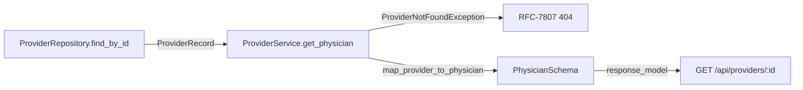
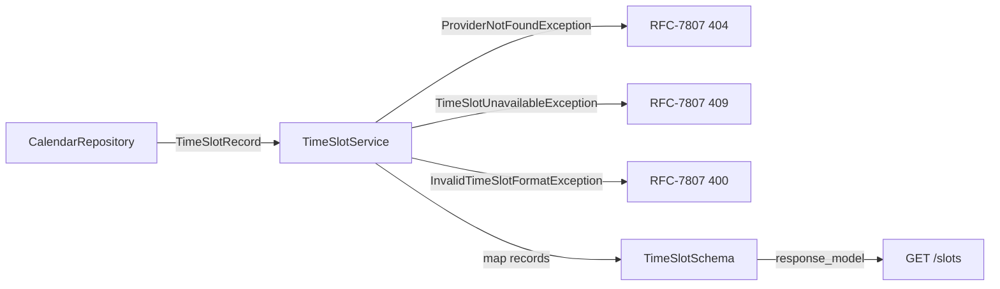
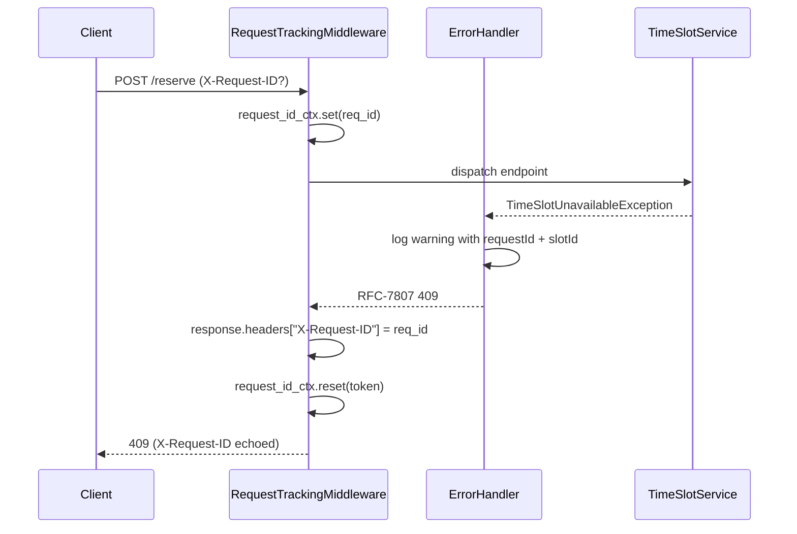

# IOPHA: Technical Design (Low-Level Design)

## Table of Contents

| #   | Section                                                       | Description                                            |
| --- | ------------------------------------------------------------- | ------------------------------------------------------ |
| 1   | [Technology Stack](#1-technology-stack)                       | Frontend, backend, database, and testing technologies  |
| 2   | [Frontend Implementation](#2-frontend-implementation-details) | Styling, logging, state management, performance        |
| 3   | [Backend Implementation](#3-backend-implementation-details)   | Database schema, PII/PHI sanitization, logging, RAG pipeline, global exception handling |
| 4   | [Testing Strategy](#4-testing-strategy)                       | Unit, integration, E2E, visual regression, performance |
| 5   | [CI/CD & Deployment](#5-cicd--deployment)                     | GitHub Actions, environment config, local dev          |
| 6   | [Decision Points](#6-decision-points-pending)                 | Pending architectural decisions                        |

## 1. Technology Stack

| Layer              | Technology                        | Version | Status      |
| ------------------ | --------------------------------- | ------- | ----------- |
| Frontend Framework | React                             | 18      | In use      |
| Language           | TypeScript                        | 5       | In use      |
| Build Tool         | Vite                              | 8       | In use      |
| Styling            | Tailwind CSS                      | v4      | In use      |
| Component Library  | shadcn/ui + Radix UI              | Confirmed | In use    |
| Backend Framework  | FastAPI                           | 0.139   | In use      |
| ASGI Server        | Uvicorn                           | 0.51    | In use      |
| Language           | Python                            | 3.11    | In use      |
| Validation         | Pydantic (v2)                     | 2.13    | In use      |
| Metrics            | prometheus-fastapi-instrumentator | 8.0     | In use      |
| HTTP Client (test) | httpx                             | 0.28    | In use      |
| ORM                | SQLAlchemy                        | Latest  | Pending     |
| Database           | PostgreSQL + pgvector             | 15      | Pending\*   |
| Testing (Backend)  | pytest                            | 9.1     | In use      |
| Async Tests        | pytest-asyncio                    | 1.4     | In use      |
| Coverage           | pytest-cov                        | 7.1     | In use      |
| Linting            | Ruff                              | 0.15    | In use      |
| Type Checking      | Mypy (strict)                     | 2.2     | In use      |
| SAST               | Bandit                            | 1.9     | In use      |
| Testing (E2E)      | Cypress                           | Latest  | In use      |
| Load Testing       | Locust                            | Latest  | Planned     |

\*Pending: persistence is abstracted behind the `ProviderRepository`
interface; the default `InMemoryProviderRepository` ships today and no
relational datastore is wired. A SQLAlchemy + PostgreSQL + pgvector backend
will replace the in-memory default behind the same interface (see §3.1).

```
/IOPHA
├── /IOPHA-frontend
│   ├── /src
│   │   ├── /components        # React components (each in own directory)
│   │   │   ├── /LandingPage/
│   │   │   ├── /RiskProfileSidebar/
│   │   │   ├── /ChatArea/
│   │   │   └── /ui/           # shadcn/ui primitives (copied from IOPHA Resources)
│   │   ├── /hooks             # Custom hooks (useLogRenders, usePerformanceTracking)
│   │   ├── /utils
│   │   │   ├── logger.ts      # Custom Logger class
│   │   │   └── performance.js # Performance monitoring utilities
│   │   ├── /services          # API client wrappers
│   │   ├── /types             # TypeScript interfaces
│   │   └── App.tsx
│   ├── cypress.config.ts
│   └── package.json
├── /IOPHA-backend
│   ├── /app
│   │   ├── main.py                # FastAPI entry point — wiring only
│   │   ├── dependencies.py        # FastAPI dependency factories
│   │   ├── /controllers           # HTTP route controllers (one per resource)
│   │   │   └── providers.py       # GET /api/providers/{provider_id}
│   │   ├── /services              # Business logic / orchestration
│   │   │   └── provider_service.py
│   │   ├── /repositories          # Persistence abstractions (ABC + in-memory)
│   │   │   └── provider_repository.py
│   │   ├── /schemas               # Pydantic contracts + internal relational shapes
│   │   │   ├── /physician/        # PhysicianSchema (frontend DTO)
│   │   │   └── /provider/         # ProviderRecord, mappers
│   │   ├── /middleware            # ASGI interceptors (request tracing)
│   │   │   └── request_tracing.py
│   │   ├── /exceptions            # Domain exceptions + registry
│   │   │   └── domain_errors.py
│   │   └── /utils                 # Cross-cutting utilities
│   │       ├── context.py         # contextvars request-id correlation
│   │       ├── handlers.py        # Global RFC-7807 exception handlers
│   │       └── logging.py         # JsonTelemetryFormatter + logging middleware
│   ├── /tests                     # pytest suites (isolated via dependency_overrides)
│   │   ├── /helpers               # dependency_overrides utilities
│   │   ├── conftest.py
│   │   ├── test_providers.py
│   │   ├── test_request_tracing.py
│   │   ├── test_exception_handlers.py
│   │   └── test_structured_logging.py
│   ├── pyproject.toml             # ruff / mypy / bandit / pytest / coverage config
│   └── requirements.txt
├── /docs                          # Architecture & security documentation
└── /infra                        # Terraform/CDK configurations
```
## 2. Frontend Implementation Details

### 2.1 Styling with Tailwind CSS

The frontend uses Tailwind CSS v4 with the IOPHA brand theme (copied from IOPHA Resources):

- Primary color: `#0A6B7C` (teal)
- Accent color: `#D95B3B` (orange)
- Background: `#F3F1EC` (warm off-white)
- All component styling uses Tailwind utility classes via the `cn()` helper (clsx + tailwind-merge)

UI components are sourced from IOPHA Resources (shadcn/ui primitives) and copied into `src/components/ui/`. Components use Radix UI primitives under the hood (`@radix-ui/react-*` packages).

### 2.2 Logging & Observability

**Custom Logger Class** (`src/utils/logger.ts`):

```typescript
class Logger {
  static debug(message: string, ...args: unknown[]): void;
  static info(message: string, ...args: unknown[]): void;
  static warn(message: string, ...args: unknown[]): void;
  static error(message: string, ...args: unknown[]): void;
}
```

Environment behavior:

- Development: Logs all levels (debug, info, warn, error)
- Production: Suppresses debug, info, warn; only error level emitted

**Namespace Helpers**:

- `app:render`, `app:api`, `app:router` - selective console output for application domains
- No-ops in production builds

**Render-Tracking Hook** (`useLogRenders`):

- Monitors functional component render frequency using `useRef` and `useEffect`
- Logs render count and optional shallow prop snapshot
- Available in `src/hooks/useLogRenders.ts`

**Error Boundaries** (`src/components/AppErrorBoundary.tsx`):

- Uses `react-error-boundary` for functional error boundaries
- Russian Doll pattern: Root → Layout → Feature level isolation
- Structured error logging: message, stack, component stack
- Fallback UI: Localized with "Try again" reset button, no external API calls

### 2.3 State Management & Data Fetching

Strategy:

- Server state: React Query (TanStack Query) or SWR for caching, background updates
- Client state: React Context or Zustand for UI state

### 2.4 Performance Monitoring

**React Profiler Integration**:

- Root-level and route-boundary profiling
- `onRender` callback logs: id, phase, actualDuration, baseDuration, startTime, commitTime

**Performance Hook** (`usePerformanceTracking`):

- Captures render durations via `useRef` and `useLayoutEffect`/`useEffect`
- Warning emitted if render exceeds 16ms (60fps threshold)

**Page Metrics** (`logPagePerformanceMetrics`):

- DNS lookup, TCP connection, TTFB, DOM interactive, DOM loaded, load complete
- First Paint, First Contentful Paint via Paint Timing API

## 3. Backend Implementation Details

### 3.1 Data Access & Persistence

> **Current state:** the backend has **no production database dependency**.
> Data access is abstracted behind the `ProviderRepository` protocol
> (`app/repositories/provider_repository.py`); the default
> `InMemoryProviderRepository` is a pure in-memory stand-in so the scheduling
> pipeline runs, is tested, and passes CI without any datastore. A relational
> backend (SQLAlchemy + PostgreSQL + pgvector) will replace the in-memory
> default behind the same interface — no caller (service, controller) changes
> when that lands.

**Repository Contract** (`app/repositories/provider_repository.py`):

| Member        | Signature                                          | Purpose                                                                 |
| ------------- | -------------------------------------------------- | ----------------------------------------------------------------------- |
| `find_by_id`  | `(provider_id: str) -> ProviderRecord \| None`     | Resolve the internal relational record for a provider id, or `None` if absent (drives the 404 path). |

**Intended Relational Schema** (provisional — not yet implemented; pending the
SQLAlchemy backend described in §1):

| Table          | Purpose                                 |
| -------------- | --------------------------------------- |
| users          | User accounts with role (patient/admin) |
| organizations  | Hospital/health system affiliations     |
| sessions       | Chat session tracking                   |
| messages       | Chat message history                    |
| guidelines     | Clinical guidelines with vector column  |
| ingestion_jobs | Document processing status              |

- Indexes: GIN indexes for full-text search on text columns; IVFFlat/HNSW index for vector similarity search on embeddings.
- `PGVECTOR_DIMENSION` default: 1536 (text-embedding-3-small).

### 3.2 PII/PHI Sanitization Architecture

A defense-in-depth sanitization strategy is implemented across three layers to prevent accidental PHI exposure in logs, metrics, and API responses.

**Layer 1 — HTTP Transport Middleware** (`PIISanitizationMiddleware`):

- Normalizes dynamic URL paths before they reach logging/metrics middleware (e.g., `/patients/12345` → `/patients/:id`)
- Redacts sensitive query parameters (`ssn`, `email`, `phone`, `medical_record_number`)
- Attaches sanitized values to `request.state` for downstream consumers
- Registered **before** logging and metrics middleware to ensure raw paths are never captured

**Layer 2 — Logging Filter** (`PIISanitizerFilter`):

- Uses Python's standard `logging.Filter` attached to the root logger
- Intercepts all `LogRecord` objects before JSON formatter serializes them
- Regex patterns redact email, phone, and SSN from `record.msg`, `record.args`, and `record.extra`
- Handles `record.args` tuple immutability by reconstructing and reassigning the tuple
- Patterns are optimized to prevent catastrophic backtracking in the async event loop

**Layer 3 — Pydantic DTO Serializers**:

- External-facing response models (DTOs) use `@field_serializer` to mask PII fields
- Internal domain models remain unmasked for database operations
- Enforces strict separation between internal and external data representations

**Rationale for DTO Separation**:
Applying `@field_serializer` to internal domain models would mask data needed for database writes and internal business logic. By separating internal models from external DTOs, we ensure serializers only apply at the API boundary.

### 3.3 Structured JSON Logging & Auditing

The backend emits structured JSON logs for every HTTP transaction, enabling direct ingestion by CloudWatch and Elasticsearch without custom parsers.

**Log Key Schema**:

| Field | Type | Description |
|---|---|---|
| `timestamp` | ISO string | Event time in ISO 8601 format |
| `level` | string | Log severity: `INFO`, `WARNING`, `ERROR` |
| `logger` | string | Logger namespace (e.g., `iopha.backend`) |
| `message` | string | Event name (`request.start` or `request.complete`) |
| `requestId` | string | Client-supplied correlation/tracing identifier, propagated as-is |
| `method` | string | HTTP method |
| `path` | string | Sanitized URL path with dynamic segments normalized |
| `userAgent` | string | Client user agent |
| `status` | int | HTTP response status code |
| `durationMs` | int | Request processing duration in milliseconds |
| `responseSize` | int | Response payload size in bytes |
| `queryParams` | object | Sanitized query parameters |
| `exc_info` | string | Exception traceback (present only when an exception is logged) |
| `stack_info` | string | Stack information (present only when explicitly captured) |

**Path-Masking Regular Expressions**:

| Pattern | Replacement | Purpose |
|---|---|---|
| `/patients/\d+` | `/patients/:id` | Normalize patient endpoint cardinality |
| `/providers/\d+` | `/providers/:id` | Normalize provider endpoint cardinality |
| `/sessions/\d+` | `/sessions/:id` | Normalize session endpoint cardinality |
| `/users/\d+` | `/users/:id` | Normalize user endpoint cardinality |

**User ID Masking**:
- Raw format: `user_123456`
- Masked format: `user_***456`
- Rationale: Prevents full user ID exposure in logs while preserving traceability for debugging
- Scope: Applied only to genuinely sensitive user identifiers. Correlation/tracing headers such as `X-Request-ID` are client-supplied and must NOT be masked, as they are required for audit trail traceability across distributed systems.

**Serialization Configuration**:
- Custom `JsonTelemetryFormatter` extends `logging.Formatter`
- Outputs compact JSON via `json.dumps(log_payload, default=str)`
- Attaches to `logging.StreamHandler` for stdout streaming
- Logger namespace: `iopha.backend`

**Middleware Execution Order**:
1. `RequestTracingMiddleware` runs outermost. It reads the inbound `X-Request-ID` header, mints a UUID when absent, and binds the value to the `request_id_ctx` `contextvars.ContextVar` for the request lifetime. The resolved id is echoed on the response `X-Request-ID` header. All downstream logging, services, repositories, and background tasks read the same trace without parameter threading. The token is reset in a `finally` block so the context cannot leak across requests or async tasks.
2. `CentralizedLoggingMiddleware` captures request metadata and logs `request.start`, then logs `request.complete` after all downstream processing completes. Each log line carries `requestId` sourced live from `request_id_ctx` by `JsonTelemetryFormatter`.
3. `PIISanitizationMiddleware` (planned) — path normalization and sensitive query-parameter redaction are designed to run ahead of logging; it is **not yet enabled** in the current build.

**Context-Threaded Tracing Flow** (`app/utils/context.py`, `app/middleware/request_tracing.py`):

```mermaid
sequenceDiagram
    participant C as Client
    participant T as RequestTracingMiddleware
    participant L as CentralizedLoggingMiddleware
    participant Ctrl as ProviderController
    participant Svc as ProviderService
    participant Repo as ProviderRepository

    C->>T: GET /api/providers/{id} (X-Request-ID?)
    T->>T: req_id = header or uuid4(); request_id_ctx.set(req_id)
    T->>L: call_next(request)
    L->>L: log request.start (requestId from context)
    L->>Ctrl: dispatch endpoint
    Ctrl->>Svc: get_physician(id)
    Svc->>Repo: find_by_id(id)
    Repo-->>Svc: ProviderRecord | None
    Svc-->>Ctrl: PhysicianSchema | ProviderNotFoundException
    Ctrl-->>L: response
    L->>L: log request.complete (requestId from context)
    L-->>T: response
    T->>T: response.headers["X-Request-ID"] = req_id
    T->>T: request_id_ctx.reset(token)
    T-->>C: 200 / 404 (X-Request-ID echoed)
```

### 3.4 RAG Pipeline Logic

**Chunking Strategy**:

- 512-token windows with 10% overlap (51 tokens)
- Text splitter preserves sentence boundaries

**Embedding Model**:

- `text-embedding-3-small` (OpenAI) or equivalent

**Retrieval Flow**:

1. User query encoded to vector
2. Similarity search against guidelines table
3. Top-K results retrieved
4. Fallback to full-text search if vector search fails

### 3.5 Global Exception Handling & Runbook Mappings

The backend installs application-wide FastAPI exception handlers
(`app/utils/handlers.register_exception_handlers`) that intercept domain-specific
faults and any unhandled runtime error. Every handler returns a structured,
diagnostic JSON problem payload and emits a structured JSON log record through
the same `JsonTelemetryFormatter` pipeline as the request middleware.
For scrubbing rules, payload hygiene, and output boundaries, see
[Security Overview](../security/SECURITY.md).

**Error Response Object** (RFC-7807-style problem detail):

| Field | Type | Description |
|---|---|---|
| `title` | string | Client-safe, human-readable fault summary |
| `status` | int | HTTP status code returned to the client |
| `detail` | string | Client-safe explanation; never contains raw trace, memory addresses, DB schemas, or credentials |
| `instance` | string | `request.url.path` of the failing request |
| `help_url` | string | Deep-link into the centralized runbook (`docs/RUNBOOKS.md`) targeting the exact mitigation section |

**Base Runbook URL Scheme**: `GITHUB_RUNBOOK_BASE_URL` in `app/exceptions/domain_errors.py`
points at `docs/RUNBOOKS.md` on the main branch. Each error appends a `#<link>`
fragment (`_help_url`) whose value MUST match the GitHub-generated slug of the
corresponding markdown header (lowercase, spaces → hyphens, punctuation
stripped) or the link 404s.

**Exception-to-Link Routing Map** (registered in `app/exceptions.DOMAIN_EXCEPTIONS`):

| Exception | Status Code | Log Event | Link |
|---|---|---|---|
| `RaceConditionDoubleBookingError` | 409 | `scheduling.race_condition_double_booking` | `race-condition-double-booking` |
| `TimeZoneMismatchError` | 400 | `scheduling.timezone_mismatch` | `time-zone-mismatch` |
| `AvailabilityDriftError` | 409 | `scheduling.availability_drift` | `availability-drift` |
| `OverlappingModifierConflictError` | 409 | `scheduling.overlapping_modifier_conflict` | `overlapping-modifier-conflict` |
| `WebSocketConnectionDropError` | 503 | `chat.websocket_connection_drop` | `websocket-connection-drop` |
| `OutOfOrderMessageDeliveryError` | 409 | `chat.out_of_order_message_delivery` | `out-of-order-message-delivery` |
| `UnreadNotificationInconsistencyError` | 409 | `chat.unread_notification_inconsistency` | `unread-notification-inconsistency` |
| `AttachmentPayloadTooLargeError` | 413 | `chat.attachment_payload_too_large` | `payload-too-large` |
| `ExternalCalendarSyncDisconnectedError` | 502 | `integration.external_calendar_sync_disconnect` | `external-calendar-sync-disconnect` |
| `UpstreamWebhookFailureError` | 502 | `integration.upstream_webhook_failure` | `upstream-webhook-failure` |
| `NotificationGatewayTimeoutError` | 504 | `integration.notification_gateway_timeout` | `notification-gateway-timeout` |
| `InvalidViewTransitionError` | 409 | `state_machine.invalid_view_transition` | `invalid-view-transition` |
| `ExpiredBookingSessionError` | 410 | `state_machine.expired_booking_session` | `expired-booking-session` |
| `ProviderNotFoundException` | 404 | `directory.provider_not_found` | `provider-not-found-error` |

**Global Catch-All**: A handler registered for base `Exception` returns `500`
with a generic detail and `help_url` link `internal-server-error`. It captures
the full trace server-side via `exc_info=True` but never exposes exception text
to the client.

**Logging Contract**: Structured context is attached via `extra={"extra_context": {...}}`
so the `JsonTelemetryFormatter` serializes it as root-level JSON. The global
handler logs `requestId`, `path`, and `userAgent`; each domain handler logs
`requestId`, `path`, plus only non-sensitive identifiers (slot/patient/session
ids) from `IOPHADomainError.log_context`. All handler logging degrades
gracefully when `X-Request-ID` or `user-agent` headers are missing
(defaulting to `"unknown"`).

**Security Boundaries**: See [Security Overview](../security/SECURITY.md) —
error payloads are scrubbed of credentials and sensitive trace data before
client delivery; raw stack traces exist only in server logs.

## 3.6 Provider / Physician Scheduling Core API

The scheduling resource pipeline establishes the core FastAPI routing engine,
Pydantic contracts, and isolated test scaffolding for the physician/provider
directory modules.

### 3.6.1 Layered Architecture

| Layer | Module | Responsibility |
|---|---|---|
| Controller | `app/controllers/providers.py` | HTTP surface; binds routes, delegates to the service, returns the frontend contract. No persistence or business rules. |
| Service | `app/services/provider_service.py` | Lookup orchestration, mapping, and domain-fault raising (`ProviderNotFoundException`). |
| Repository | `app/repositories/provider_repository.py` | `ProviderRepository` ABC + `InMemoryProviderRepository` no-DB stand-in. |
| Schemas | `app/schemas/` | `PhysicianSchema` (frontend DTO) and `ProviderRecord` (internal relational shape) under `physician/` and `provider/` subpackages. |
| Dependencies | `app/dependencies.py` | `get_provider_repository` FastAPI dependency, overridden in tests. |
| Tracing | `app/middleware/request_tracing.py`, `app/utils/context.py` | `X-Request-ID` correlation via `contextvars`. |
| Logging | `app/utils/logging.py` | `JsonTelemetryFormatter` + `CentralizedLoggingMiddleware`. |

### 3.6.2 Route Contract

- `GET /api/providers/{provider_id}` → `PhysicianSchema` (200) or RFC-7807 problem (404).
- The controller resolves a `ProviderController` per request via the
  `get_provider_controller` factory, which wires `get_provider_repository` →
  `ProviderService` → `ProviderController`.

### 3.6.3 Data Conversion Pathway (Relational → Frontend)

Internal datastore rows arrive as `ProviderRecord` (a `@dataclass` carrying the
relational shape, including the `db_primary_key` structural identifier used only
for persistence). `map_provider_to_physician()` projects only client-safe,
frontend-aligned fields into `PhysicianSchema`. The internal `db_primary_key`
is **deliberately dropped** so it never crosses the API boundary. Both
`PhysicianSchema` uses `model_config = ConfigDict(extra="forbid")`
for rigid, defensive validation of the external contract.



### 3.6.4 Transaction Schema Rules

- Frontend DTOs use camelCase field names dictated by the API contract
  (`reviewCount`, `nextAvailable`, `imageUrl`); these are intentional and
  excluded from N815 lint enforcement on `app/schemas/**`.
- Internal `ProviderRecord` is never serialized directly to clients.
- Structural identifiers and credentials are never placed in the response body
  or in `extra_context` log payloads.

## 3.7 Time Slot Availability API

The time-slot resource pipeline extends the core scheduling engine with a
provider-availability endpoint, Pydantic slot contracts, request-tracing
middleware, structured JSON logging, PHI scrubbing, and RFC-7807 error
handling.

### 3.7.1 Layered Architecture

| Layer | Module | Responsibility |
|---|---|---|
| Controller | `app/controllers/timeslots.py` | HTTP surface for `GET /api/providers/{provider_id}/slots` and `POST /api/providers/{provider_id}/slots/{id}/reserve`. |
| Service | `app/services/timeslot_service.py` | Lookup orchestration, slot validation, and domain-fault raising. |
| Repository | `app/repositories/calendar_repository.py` | `CalendarRepository` ABC + `InMemoryCalendarRepository` no-DB stand-in. |
| Schemas | `app/schemas/timeslot.py` | `TimeSlotSchema` (frontend DTO) and `TimeSlotRecord` (internal shape). |
| Dependencies | `app/dependencies.py` | `get_calendar_repository` FastAPI dependency, overridden in tests. |
| Tracing | `app/middleware/request_tracing.py`, `app/core/context.py` | `X-Request-ID` correlation via `contextvars`. |
| Logging | `app/utils/logging.py`, `app/core/logging_config.py` | `JsonTelemetryFormatter` + `CentralizedLoggingMiddleware` + `JSONLogFormatter`. |
| PHI Scrubbing | `app/core/phi_scrubber.py` | Redacts PII/PHI from log messages before serialization. |
| Exceptions | `app/exceptions/timeslot_exceptions.py` | Domain exceptions mapped to HTTP status codes. |
| Error Handlers | `app/api/error_handlers.py` | RFC-7807 problem detail responses with runbook deep-links. |

### 3.7.2 TimeSlotSchema

The external contract returned by the availability API (`TimeSlotSchema`):

| Field | Type | Validation | Description |
|---|---|---|---|
| `id` | `str` | Pattern: `^\d{4}-\d{2}-\d{2}-(0[1-9]|1[0-2]):[0-5][0-9] (AM|PM)$` | Unique slot key embedding ISO date + civil time (e.g. `2024-01-15-09:00 AM`). |
| `time` | `str` | Pattern: `^(0[1-9]|1[0-2]):[0-5][0-9] (AM|PM)$` | Display time in 12-hour civil format (e.g. `09:00 AM`). |
| `label` | `str` | None | Human-readable label rendered on the slot button. |
| `available` | `bool` | None | Whether the slot can still be booked. |

Configuration: `model_config = ConfigDict(extra="forbid")` so no unplanned
fields can cross the API boundary.

Validation helpers:

- `TimeSlotSchema.is_valid_time(value) -> bool` — validates civil time pattern.
- `TimeSlotSchema.is_valid_slot_id(value) -> bool` — validates composite slot-id pattern.

### 3.7.3 Route Contract

- `GET /api/providers/{provider_id}/slots` → `list[TimeSlotSchema]` (200) or
  RFC-7807 problem (404 `ProviderNotFoundException`).
- `POST /api/providers/{provider_id}/slots/{slot_id}/reserve` → `{"status":
  "reserved", "slot_id": str}` (200) or RFC-7807 problem (409
  `TimeSlotUnavailableException`, 400 `InvalidTimeSlotFormatException`).

The controller resolves a `TimeSlotController` per request via the
`get_timeslot_controller` factory, which wires
`get_calendar_repository` → `TimeSlotService` → `TimeSlotController`.

### 3.7.4 Data Conversion Pathway

`TimeSlotRecord` (internal repository shape with `id`, `time`, `label`,
`available`) is projected into `TimeSlotSchema` inside
`TimeSlotService.get_slots()`. No structural identifiers leak because the
internal record contains only slot attributes.



### 3.7.5 Middleware & Logging Stack

The availability API runs inside the same middleware stack as the directory
API, with the ticket-named `RequestTrackingMiddleware` subclass registered
under the availability resource.

**Middleware:**

1. `RequestTrackingMiddleware` — outermost. Reads inbound `X-Request-ID` or
   mints a UUID; binds to `request_id_ctx` `ContextVar`; echoes on response
   header; resets in `finally` to prevent context leaks.
2. `CentralizedLoggingMiddleware` — logs `request.start` and `request.complete`
   with method, path, status, and duration.
3. `ProblemAPIRoute` — catches `RequestValidationError` and projects it into
   a `ProblemDetail` (RFC-7807) payload.
4. `register_timeslot_error_handlers` — maps slot-domain exceptions to their
   corresponding HTTP status codes and problem payloads.

**Logging formatters:**

1. `JsonTelemetryFormatter` / `JSONLogFormatter` — serializes logs as compact
   JSON, scrubbing PHI via `PHIScrubber`.

### 3.7.6 Exception Hierarchy & Handling Flow

All availability exceptions inherit from `AppBaseException`, which itself
inherits from `IOPHADomainError`. The base class provides `status_code = 500`,
`log_level = ERROR`, and a `log_context()` hook.

| Exception | Status | Log Event | Link |
|---|---|---|---|
| `TimeSlotUnavailableException` | 409 | `timeslot.unavailable` | `time-slot-unavailable` |
| `ProviderNotFoundException` | 404 | `directory.provider_not_found` | `provider-not-found-error` |
| `InvalidTimeSlotFormatException` | 400 | `timeslot.invalid_format` | `invalid-time-slot-format` |

Each exception stores a single non-sensitive identifier (`slot_id` or
`provider_id` or `details`). `safe_detail()` returns a client-safe string.
`log_context()` returns a dict of those non-sensitive identifiers, which the
error handler injects into the structured log record under
`extra={"extra_context": ...}`.

The global catch-all handler (`Exception`) returns 500 with a generic detail
and `help_url` link `internal-server-error`; raw traces are captured
server-side only via `exc_info=True` and never exposed to the client.

### 3.7.7 Request Tracking Lifecycle

```mermaid
sequenceDiagram
    participant C as Client
    participant T as RequestTrackingMiddleware
    participant L as CentralizedLoggingMiddleware
    participant Ctrl as TimeSlotController
    participant Svc as TimeSlotService
    participant Repo as CalendarRepository

    C->>T: GET /api/providers/{id}/slots (X-Request-ID?)
    T->>T: req_id = header or uuid4(); request_id_ctx.set(req_id)
    T->>L: call_next(request)
    L->>L: log request.start (requestId from context)
    L->>Ctrl: dispatch endpoint
    Ctrl->>Svc: get_slots(provider_id)
    Svc->>Repo: get_provider / get_slots
    Repo-->>Svc: TimeSlotRecord[]
    Svc-->>Ctrl: list[TimeSlotSchema]
    Ctrl-->>L: response
    L->>L: log request.complete (requestId from context)
    L-->>T: response
    T->>T: response.headers["X-Request-ID"] = req_id
    T->>T: request_id_ctx.reset(token)
    T-->>C: 200 (X-Request-ID echoed)
```

On fault:



## 4. Testing Strategy

### 4.1 Unit Tests

- Framework: pytest
- Coverage target: 80%

### 4.2 Integration Tests

- FastAPI `TestClient` drives all API routes against the in-process `app`
- No production datastore: the repository dependency is overridden per test
  (`get_calendar_repository` for time slots, `get_provider_repository` for
  providers), so the endpoint is exercised end-to-end against an in-memory double
- Time-slot endpoints are validated for success, 404, 400, and 409 RFC-7807
  problem paths

### 4.3 E2E Tests

- Framework: Cypress with Cucumber Preprocessor
- Browsers: Chrome, Firefox, Edge (matrix strategy)
- `fail-fast: false` for full browser coverage

### 4.4 Visual Regression Tests

- Tool: cypress-image-diff-js
- Artifacts: `cypress-visual-screenshots/`, `cypress-visual-report/`
- Auto-excluded via `.gitignore`

### 4.5 Performance Tests

- Tool: Locust
- Target: 100 concurrent users, <2s p95 latency

### 4.6 Testing Infrastructure

**Test Dependencies**:
- **pytest**: Test runner with plugin ecosystem
- **pytest-asyncio**: Async test support with `asyncio_mode = "auto"`
- **pytest-cov**: Coverage measurement with reporting (XML, HTML, terminal)
- **httpx**: HTTP client for TestClient transport
- **coverage**: Core coverage measurement library (installed via pytest-cov)
- Configuration in `IOPHA-backend/requirements.txt` and `IOPHA-backend/pyproject.toml`

**Pytest Configuration**:
- `testpaths = ["tests/unit", "tests/e2e", "tests/integration"]`
- `python_files = ["test_*.py"]`
- `asyncio_mode = "auto"` for automatic async loop handling

**Coverage Configuration** (`IOPHA-backend/pyproject.toml`):

| Setting | Value | Purpose |
|---------|-------|---------|
| `source` | `["app"]` | Measure coverage only for the application package |
| `branch` | `true` | Track branch coverage (if/else paths) |
| `fail_under` | `80` | Minimum coverage percentage required to pass |
| `show_missing` | `true` | Display line numbers of uncovered lines in report |
| `exclude_lines` | pragmas, `__repr__`, `NotImplementedError`, `__main__`, `TYPE_CHECKING` | Exclude boilerplate from coverage |

**Coverage Commands**:

```bash
# Run tests with coverage report in terminal
pytest tests --cov=app --cov-report=term

# Run tests with XML and HTML reports
pytest tests --cov=app --cov-report=xml --cov-report=html

# Run all CI checks (used in GitHub Actions)
pytest tests --doctest-modules --junitxml=junit/test-results.xml --cov=app --cov-report=xml --cov-report=html
```

**Asset Lifecycle Patterns**:
- Repository isolation: override the relevant factory (`get_calendar_repository` for time slots, `get_provider_repository` for providers) via `app.dependency_overrides` and clear it in teardown (no datastore touched)
- External services: override via dependency injection, not network mocking
- Test data: factory-generated, deterministic, and isolated per test case

**Backend Test Reporting**:
- JUnit XML: `junit/test-results.xml` for CI test result ingestion
- Coverage reports: XML (`coverage.xml`) and HTML (`htmlcov/`) generated via `pytest-cov`
- Target coverage: 80%
- Coverage scope: `--cov=app` (application package)

### 4.7 Code Quality & Linting

**Backend Linting & Type Checking**:

- **Ruff**: Fast Rust-based linter with Pyflakes (F), Pycodestyle (E/W), isort (I), Pydocstyle (N), Bandit Security (S), Bugbear (B), and Pylint Refactoring (PLR) rules
- **Mypy**: Static type checker with strict mode enabled (disallow_untyped_defs, warn_return_any, etc.)
- Configuration in `IOPHA-backend/pyproject.toml`

**For more information, read the security document.** ([docs/security/SECURITY.md](security/SECURITY.md))

**ESLint Configuration**:

- Version: ESLint 9.x (flat config format)
- Config file: `eslint.config.js` (replaces deprecated `.eslintrc.cjs`)
- TypeScript support: `@typescript-eslint/parser` and `@typescript-eslint/eslint-plugin`
- TanStack Query plugin: `@tanstack/eslint-plugin-query` for exhaustive-deps rule
- Ignores: `node_modules/`, `dist/`, `cypress/`

**Lint Script**:

```bash
npm run lint
# Executes: eslint src --max-warnings=0
```

**Pre-commit Hooks**:

- Husky pre-commit hook runs ESLint with `--fix` on staged `.ts` and `.tsx` files
- Pre-push hook runs: lint, duplicate step check, E2E tests, component tests, and security audit

\*\*IMPORTANT: Never bypass hooks with `--no-verify` or any other mechanism. All hooks must run to catch errors locally before they reach CI. The pre-push hook runs the same checks as GitHub Actions (lint, E2E tests, component tests, security audit). If a hook fails, fix the underlying issue instead of attempting to bypass it.

### 4.7 CI Integration

- Tests run on every PR to main
- JUnit XML and coverage reports uploaded as artifacts
- Screenshots uploaded as artifacts on failure

## 5. CI/CD & Deployment

### 5.1 GitHub Actions Workflows

**ci-frontend.yml**:

- Lint step: `npm run lint` (ESLint 9.x with flat config `eslint.config.js`)
- Duplicate step check: `npm run cy:check-steps`
- E2E tests: `npm run test:e2e` (Cypress with Cucumber BDD)
- Component tests: `npx cypress run --component`
- Security audit: `npm audit --omit=dev --audit-level=high`
- Cypress E2E matrix (chrome, firefox, edge)
- Screenshot artifacts on failure

**Note**: ESLint 9.x uses flat config format (`eslint.config.js`). The deprecated `.eslintrc.cjs` and `.eslintignore` files have been removed. The lint script no longer uses the `--ext` flag (removed in ESLint 9.x).

**ci-backend.yml**:

- Ruff linting (Pyflakes, Pycodestyle, Security, Bugbear, Refactoring)
- Ruff formatting check
- Mypy static type checking
- Bandit SAST scanning
- pip-audit for dependencies
- pytest: JUnit XML and coverage reports (80% target)

### 5.2 Observability & Metrics

**Prometheus Instrumentation**:

- Library: `prometheus-fastapi-instrumentator`
- Endpoint: `/metrics`
- Configuration choices:
  - `handle_unhandled_paths=False` — prevents cardinality explosion from undefined routes
  - `should_group_status_codes=True` — groups similar status codes to reduce metric cardinality
  - `should_ignore_untemplated=True` — ignores metrics for requests that don't match any route
  - `excluded_handlers=["/metrics"]` — excludes the metrics endpoint from being instrumented to avoid self-reporting
  - `should_gzip=True` — gzips the payload to reduce network overhead during scraping

**Path Grouping Strategy**:
Dynamic paths like `/api/providers/{provider_id}/slots` are automatically grouped by FastAPI's routing definitions. The instrumentator normalizes these paths before they reach the metrics exporter, preventing high-cardinality metric series.

**Endpoint Security**:
The `/metrics` endpoint is strictly internal. It is blocked at the API Gateway / load balancer level from external/public access and accessible only by the internal Prometheus scraper.

#### Prometheus Metrics Endpoint Security

The `/metrics` endpoint exposes internal application state, endpoint names, request patterns, and infrastructure details. It must not be exposed to the public internet or the external API Gateway.

| Control                | Implementation                                                                                  |
| ---------------------- | ----------------------------------------------------------------------------------------------- |
| Network isolation      | Block `/metrics` at the API Gateway / load balancer level                                       |
| Internal access only   | Accessible only by the internal Prometheus scraper                                              |
| Cardinality protection | `handle_unhandled_paths=False` prevents high-cardinality metric explosion                       |
| Path grouping          | `should_group_status_codes=True` and `should_ignore_untemplated=True` reduce metric cardinality |

**Risks of exposure**:

- Endpoint enumeration: Attackers can discover internal API routes and naming conventions
- Infrastructure fingerprinting: Response size, latency, and status code patterns reveal server architecture
- Cardinality DoS: If dynamic paths like `/api/providers/{provider_id}/slots` are not grouped, unique metric series can exhaust Prometheus memory

## 6. Decision Points (Pending)

| Component     | Options                           | Criteria                              |
| ------------- | --------------------------------- | ------------------------------------- |
| Auth Provider | Supabase Auth, Custom JWT         | HIPAA compliance, ease of integration |
| Frontend Host | Vercel, Netlify, Cloudflare Pages | Cold start, edge caching              |
| Backend Host  | Railway, Fly.io, AWS Fargate      | Cost, scaling, HIPAA eligibility      |
| Database      | Neon, Supabase, AWS RDS           | HIPAA eligibility, pgvector support   |
